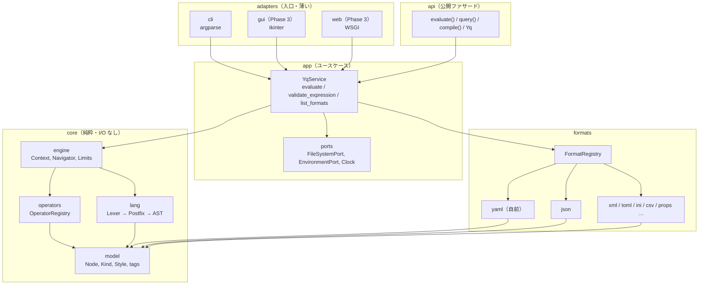
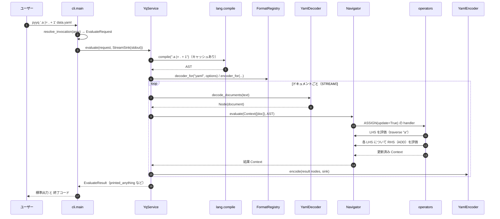
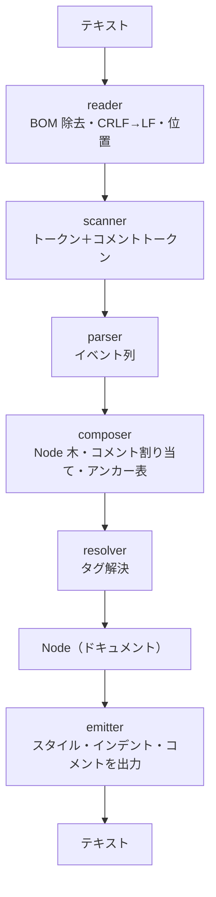
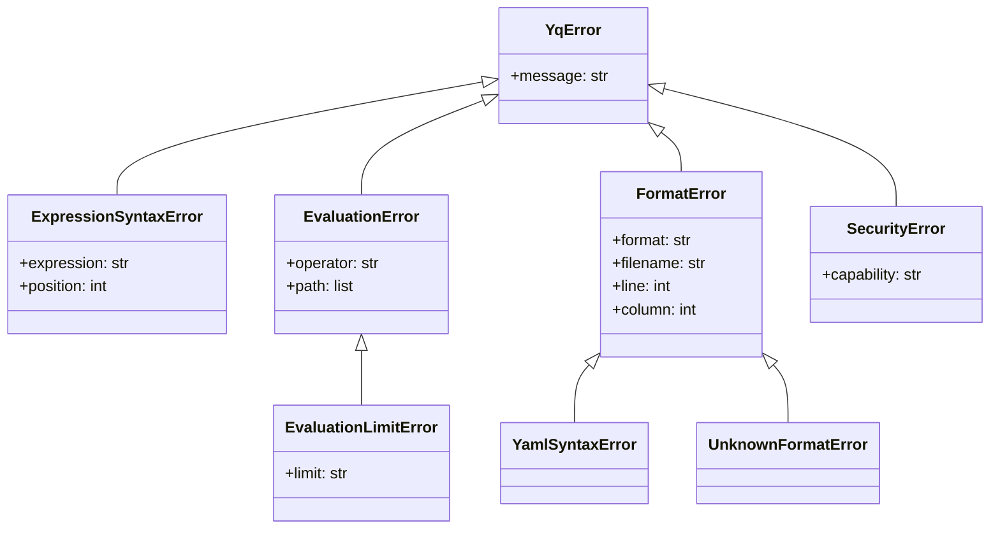
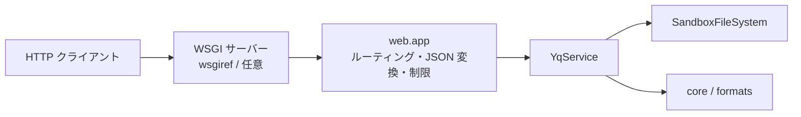
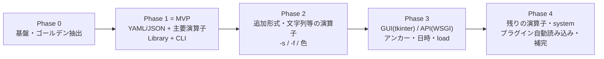

# Python 版 yq（仮称 `pyyq`）基本機能 設計書

| 項目 | 内容 |
|---|---|
| 文書 ID | 0917-02_31_design-python-yq |
| 版 | 第1.1版（自己レビューで見つけた問題を修正済み。詳しくは[付録](#付録-自己評価ログ)） |
| 作成日 | 2026-09-17 |
| 対象 | Go 製 [mikefarah/yq](https://github.com/mikefarah/yq) v4.53.6 の**基本機能**を、**Python 3.13 の標準ライブラリだけ**で再実装するための設計 |
| 前提資料 | [21_docs/0917-01_11_ref-mikefarah-yq_code-explanation.md](./0917-01_11_ref-mikefarah-yq_code-explanation.md)（以下「解説メモ」）／ローカルの [11_ref-mikefarah-yq/](../11_ref-mikefarah-yq/) |
| 利用形態 | **Library ＋ CLI**（将来 **GUI** と **API サービス**へ拡張できる層構成） |
| 開発環境 | **uv**（`pyproject.toml` / `uv.lock` / `.python-version`） |

> **読み方ガイド**
> - 全体像だけ知りたい人 → 「1」「3-1」「3-2」
> - 実装担当 → 「4」〜「9」（データモデル・式言語・評価器・演算子・フォーマット）
> - 利用者／他チーム → 「10」（公開 API）「12」（CLI）
> - 将来の GUI / API 担当 → 「11」「13」
> - テスト担当 → 「16」（テスト戦略）
> - PM → 「17」（ロードマップ・リスク）「18」（未決事項）

---

## 目次

- [0. 設計の前提（確定事項）と用語](#0-設計の前提確定事項と用語)
- [1. 目的・スコープ・非目標](#1-目的スコープ非目標)
- [2. 要求事項](#2-要求事項)
- [3. アーキテクチャ](#3-アーキテクチャ)
- [4. パッケージ構成と依存ルール](#4-パッケージ構成と依存ルール)
- [5. データモデル（Node）](#5-データモデルnode)
- [6. 式言語処理系（Lexer / Parser）](#6-式言語処理系lexer--parser)
- [7. 評価エンジン（Context / Navigator）](#7-評価エンジンcontext--navigator)
- [8. 演算子仕様（MVP と拡張計画）](#8-演算子仕様mvp-と拡張計画)
- [9. フォーマット層（Decoder / Encoder）](#9-フォーマット層decoder--encoder)
- [10. 公開 API（Library）](#10-公開-apilibrary)
- [11. アプリケーション層（YqService）](#11-アプリケーション層yqservice)
- [12. CLI 設計](#12-cli-設計)
- [13. 拡張設計（GUI / API サービス / プラグイン）](#13-拡張設計gui--api-サービス--プラグイン)
- [14. エラー処理・セキュリティ・ログ](#14-エラー処理セキュリティログ)
- [15. 開発環境とビルド（uv）](#15-開発環境とビルドuv)
- [16. テスト戦略](#16-テスト戦略)
- [17. 開発ロードマップとリスク](#17-開発ロードマップとリスク)
- [18. 未決事項と質問（Verifier）](#18-未決事項と質問verifier)
- [付録. 自己評価ログ](#付録-自己評価ログ)

---

## 0. 設計の前提（確定事項）と用語

### 0-1. 確定事項

| # | 論点 | 決定 | 設計への影響 |
|---|---|---|---|
| D1 | 依存ライブラリ | **実行時の外部依存ゼロ**（Python 標準ライブラリのみ） | YAML パーサー／エミッタを**自前で作る**。開発用ツールは `dev` グループに分け、任意とする |
| D2 | YAML の扱い | **自前実装**（コメントを保持できるもの） | `pyyq.formats.yaml` が最大の実装範囲になる（→ [9-3](#9-3-yaml自前実装の詳細)） |
| D3 | Go 版との互換レベル | **意味互換＋コメント保持**（キー順・コメント・アンカー・スカラーの書き方を保つ。インデント・クォートは可能な範囲で合わせる） | バイト単位の一致は目指さない。テストは「完全一致」と「意味一致」の2段で判定する（→ [16](#16-テスト戦略)） |
| D4 | 機能範囲 | **MVP ＋拡張の枠組み**（MVP 演算子 38 種（→ [8-2](#8-2-mvp-演算子一覧)）と主要形式を先に作り、残りはフェーズ計画に載せる） | 演算子とフォーマットを**登録制（レジストリ）**にし、後から足してもコアを変えない |
| D5 | Python | **3.13 以上**（`requires-python = ">=3.13"`） | `type` 文、PEP 695 ジェネリクス、`typing.override`、`copy.replace()`、`warnings.deprecated` が使える |
| D6 | 拡張先の技術例 | GUI は **tkinter**、API は **WSGI（`wsgiref`）** | どちらも標準ライブラリ。FastAPI／PySide などへは**アダプタを差し替えるだけ**で移れる構造にする |
| D7 | 開発環境 | **uv** | `uv init --lib` 相当の src レイアウト、`uv run` でテスト・CLI を実行（→ [15](#15-開発環境とビルドuv)） |

### 0-2. 用語

| 用語 | 意味 | Go 版での名前 |
|---|---|---|
| Node | YAML・JSON などを読み込んだ共通の木構造の節（中間表現、IR） | `CandidateNode` |
| Document | 1 ファイル内の 1 ドキュメント（YAML の `---` 区切り単位）のルート Node | `CandidateNode`（`document` 番号つき） |
| Context | 評価中の「いま注目している Node の列」と変数表 | `Context` |
| Expression / AST | `.a \| select(. > 1)` のような式と、それを解析した木 | `ExpressionNode` |
| Operator | `select`・`=`・`+` などの式の部品。Handler 関数で実装する | `operationType` ＋ `Handler` |
| Codec | 1 つのフォーマットの Decoder と Encoder の組 | `Format` ＋ `Encoder` / `Decoder` |
| Stream 評価 | ドキュメントごとに式を評価してすぐ出力する（`eval`） | `StreamEvaluator` |
| All-at-once 評価 | 全ドキュメントを読み込んでから式を 1 回評価する（`eval-all`） | `AllAtOnceEvaluator` |
| unwrap scalar | スカラーをクォートやコメントなしの生の値で出力すること（`-r`） | `UnwrapScalar` |

---

## 1. 目的・スコープ・非目標

### 1-1. 目的

1. Go 版 yq の**式言語と主要な変換機能**を、Python から `import` するだけで使えるようにする。
2. 同じ機能を **CLI（`pyyq` コマンド）**として提供し、Go 版の主要なフラグと挙動に合わせる。
3. 同じ「アプリケーション層」を使い回して、**GUI（デスクトップ）と API サービス（HTTP）**を後から追加できるようにする。
4. **外部依存ゼロ**にし、Python 3.13 さえあれば、社内のオフライン環境やサーバーレスでも導入できるようにする。

### 1-2. スコープ（MVP ＝ Phase 1 で作るもの）

| 区分 | MVP に含むもの |
|---|---|
| 入力形式 | YAML（自前）、JSON（`json`） |
| 出力形式 | YAML、JSON、props（Java properties、出力のみ） |
| 式言語 | パス取得、パイプ、union、select、代入（`=` / `\|=` / 複合代入）、算術・マージ、比較・論理、collect、map、キー／エントリ操作、del、変数、コメント・タグ・スタイルの基本（→ [8-2](#8-2-mvp-演算子一覧)） |
| 評価モード | Stream（`eval`）、All-at-once（`eval-all`）、null 入力（`-n`） |
| CLI | 主要フラグ（`-o -p -i -n -I -r -N -e -P -0 -M --from-file --expression --security-*`） |
| Library | 関数 API（`evaluate` / `evaluate_all` / `query` / `compile`）とクラス API（`Yq`） |
| 安全性 | セキュリティポリシー、評価ステップ数と時間の上限、入力サイズの上限 |

### 1-3. 非目標（やらないこと）

| 非目標 | 理由 |
|---|---|
| Go 版とバイト単位で同じ出力 | D3 の決定による。YAML の書式ゆれ（折り返し、クォートの選び方）までは追わない |
| HCL / Lua / KYAML / shell 出力 | 利用頻度に対して実装コストが高い。レジストリで後から足せるようにだけしておく |
| goccy デコーダ相当の「別実装の YAML デコーダ切り替え」 | 自前 YAML 実装は 1 つだけにする |
| YAML 1.1 の完全互換（`yes/no` を bool 扱い等） | YAML 1.2 Core Schema を基準にする（Go 版の go-yaml v4 と同じ） |
| シェル補完スクリプト生成（`completion`） | argparse に標準機能がないため後回しにする（Phase 4 で検討） |
| 色付き出力 | Phase 2（ANSI エスケープで自前実装。Windows は `os.system("")` などで VT モードを有効にする） |
| 実行速度で Go 版に並ぶこと | 純 Python のため。目標値は [2-2](#2-2-非機能要件) に置き、測りながら改善する |

---

## 2. 要求事項

### 2-1. 機能要件

| ID | 要件 | フェーズ | Go 版の根拠 |
|---|---|---|---|
| FR-01 | 式を評価してドキュメントの値を取り出せる（`.a.b[0]`） | 1 | `operator_traverse_path.go` |
| FR-02 | 値を書き換えられ、書き換えていない部分のコメント・キー順・スタイルが残る | 1 | `operator_assign.go`、`candidate_node.go` の `UpdateFrom` |
| FR-03 | 入力形式と出力形式を別々に指定でき、形式を変換できる（YAML→JSON 等） | 1 | `format.go` |
| FR-04 | 複数ドキュメント（`---`）と複数ファイルを扱える | 1 | `stream_evaluator.go` |
| FR-05 | `eval-all` でファイルをまたいだマージができる（`select(fi == 0) * select(fi == 1)`） | 1 | `all_at_once_evaluator.go` |
| FR-06 | ファイルをその場で書き換えられる（`-i`）。失敗したら元ファイルを変えない | 1 | `write_in_place_handler.go` |
| FR-07 | 入力なしで式から値を作れる（`-n`） | 1 | `EvaluateNew` |
| FR-08 | 結果がない／null／false のとき終了コードを 1 にできる（`-e`） | 1 | `evaluate_sequence_command.go` |
| FR-09 | 式をファイルから読める（`--from-file`、`.yq` 拡張子） | 1 | `cmd/utils.go` `processArgs` |
| FR-10 | 環境変数を読む演算子（`env` / `strenv`）を**許可制**で使える | 1 | `operator_env.go`、`security_prefs.go` |
| FR-11 | XML / TOML（読み込み）/ INI / CSV / TSV / properties（読み込み）/ base64 / uri を扱える | 2 | `decoder_*.go` / `encoder_*.go` |
| FR-12 | 結果をファイルに分けて出力できる（`-s`） | 2 | `printer_writer.go` `multiPrintWriter` |
| FR-13 | front matter を扱える（`-f extract\|process`） | 2 | `front_matter.go` |
| FR-14 | 文字列・日時・reduce・アンカー展開・`load` などの追加演算子 | 2〜4 | `operator_strings.go` 他 |
| FR-15 | GUI から式を試せる | 3 | —（新規） |
| FR-16 | HTTP API から式を評価できる | 3 | —（新規） |

### 2-2. 非機能要件

| ID | 区分 | 要件 | 設計上の対応 |
|---|---|---|---|
| NFR-01 | 依存 | 実行時の依存パッケージは 0 個 | `[project] dependencies = []`。CI で import を監視する（→ [16-5](#16-5-依存ゼロの自動チェック)） |
| NFR-02 | 実行環境 | CPython 3.13+、Windows / macOS / Linux | パス操作は `pathlib`、改行は入力を保つ、`os.replace` で原子的に置き換える |
| NFR-03 | 並行性 | **グローバルな可変状態を持たない**。1 プロセスで設定の違う評価を並行して動かせる | Go 版の `Configured*Preferences`（パッケージ変数）を、呼び出しごとの `Options`（変更不可の dataclass）に置き換える |
| NFR-04 | 安全性 | ライブラリの既定では副作用のある演算子（env / load / system）をすべて禁止する | `SecurityPolicy.strict()` を既定にする。CLI は Go 版と同じ既定値にする（→ [14-2](#14-2-セキュリティ)） |
| NFR-05 | 耐性 | 巨大入力・alias 爆弾・無限再帰に対して止まる | `Limits`（入力バイト数、ネスト深さ、alias 展開数、評価ステップ数、期限時刻） |
| NFR-06 | 性能（目安） | 1 MB の YAML の読み込み＋`.a.b` 評価＋出力が 1 秒程度 | 字句解析は `re` の一括マッチ、式の解析結果はキャッシュ、Node に `__slots__`。Phase 1 の終わりに測定して目標を見直す |
| NFR-07 | 保守性 | 演算子とフォーマットを**コアを変えずに**追加できる | レジストリ＋デコレータ登録（→ [13-3](#13-3-プラグイン拡張)） |
| NFR-08 | 型 | 公開 API はすべて型ヒントつき。`py.typed` を同梱する | 型チェッカーは任意の開発ツールとして扱う |
| NFR-09 | テスト | Go 版テストのシナリオを取り込み、MVP 演算子のシナリオ合格率 90% 以上（意味一致を含む） | ゴールデンデータ化（→ [16-2](#16-2-go-版シナリオのゴールデン化)） |
| NFR-10 | 国際化 | UTF-8 入出力、BOM の除去、CRLF 入力を受け付ける | Decoder の前処理でそろえる |

---

## 3. アーキテクチャ

### 3-1. 方針

Go 版の「**インタプリタ＋パイプ＆フィルタ＋フォーマット登録簿**」という骨格はそのまま受け継ぎ（解説メモ 1-B）、その外側を **ヘキサゴナル（Ports & Adapters）** で包みます。

- **中心（core）**：式言語・評価器・演算子・データモデル。**ファイルもネットワークも知らない**純粋な計算部品。
- **フォーマット（formats）**：テキスト ⇄ Node の変換。core のデータモデルだけに依存。
- **アプリケーション（app）**：「ファイルを読んで、評価して、書く」という**利用シナリオ**。CLI / GUI / API が共通で使う。
- **アダプタ（adapters）**：CLI・GUI・Web。**入力を受け取り app を呼ぶだけ**の薄い層。

> **なぜこうするか（CoT）**
> Go 版では `cmd` が yqlib のグローバル設定を直接書き換えていました（解説メモ 4-2）。CLI しかなければそれで困りませんが、GUI や API サービスでは「複数の利用者が、違う設定で、同時に」評価します。そこで、**設定は呼び出しのたびにオブジェクトで渡す**、**I/O はポート（抽象）越しに行う**、という 2 点をアーキテクチャの段階で決めておきます。こうしておけば、アダプタを増やしてもコアは変わりません。

### 3-2. レイヤ図



**依存の向きは「外側 → 内側」の一方向のみ**です。`core` は `formats` を import しません。演算子が `to_json` などのエンコードを使いたいときは、評価時に渡す `EvalEnv`（→ [7-1](#7-1-context-と-evalenv)）から `FormatRegistry` を**注入**して使います。

### 3-3. Go 版との対応表

| Go 版（yqlib / cmd） | Python 版 | 変えた点と理由 |
|---|---|---|
| `CandidateNode` | `pyyq.core.model.Node` | `__slots__` つき通常クラス。Go 版と同じく**値は文字列＋タグで持つ**（元の書き方を失わないため） |
| `Context{MatchingNodes *list.List, Variables, DontAutoCreate}` | `Context`（`nodes: tuple[Node, ...]`、`variables`、`read_only`） | 列は `tuple` で変更不可にし、`child()` で新しく作る |
| `dataTreeNavigator.GetMatchingNodes` | `Navigator.evaluate(ctx, ast)` | ステップ数と期限の確認を加える（API サービス用） |
| `operationType{Type, NumArgs, Precedence, Handler}` | `OperatorSpec`（frozen dataclass）＋ `OperatorRegistry` | デコレータで登録する |
| `participleYqRules`（正規表現ルール表） | `LEX_RULES: tuple[LexRule, ...]` | `re` の名前付きグループを 1 本の正規表現に結合する |
| `ConvertToPostfix` / `createExpressionTree` | `postfix.to_postfix()` / `parser.build_tree()` | 同じ操車場アルゴリズム |
| `Format{FormalName, Names, EncoderFactory, DecoderFactory}` | `FormatSpec` ＋ `FormatRegistry` | 拡張子による推定も `FormatSpec.extensions` に持たせる |
| `Configured*Preferences`（グローバル） | `Options` / `YamlOptions` / `JsonOptions` …（frozen dataclass） | **グローバル状態をなくす**（NFR-03） |
| `ConfiguredSecurityPreferences` | `SecurityPolicy` | ライブラリの既定を strict にする |
| `StreamEvaluator` / `AllAtOnceEvaluator` | `EvalMode.STREAM` / `EvalMode.ALL` | 別クラスではなく 1 つのサービスの引数にする（解説メモ 3-2 で指摘した重複の解消） |
| `Printer` / `PrinterWriter` | `ResultPrinter` / `OutputSink` | Sink を差し替えて stdout・メモリ・分割ファイルに出す |
| `writeInPlaceHandler` | `FileSystemPort.atomic_write()` | `tempfile` ＋ `os.replace` |
| `cmd/utils.go` `initCommand` | `cli.args.resolve_invocation()` | 引数から `EvaluateRequest` を作る純粋関数にする（テストしやすくするため） |

### 3-4. 処理の流れ（CLI から出力まで）



---

## 4. パッケージ構成と依存ルール

### 4-1. リポジトリ構成（uv の src レイアウト）

パッケージ名は **仮称 `pyyq`** とします（PyPI の `yq` は kislyuk/yq が使用中。解説メモ 4-2）。

```text
pyyq/                                  ← 開発リポジトリのルート（このリポジトリの 3x_ 配下などに作る想定）
├── pyproject.toml                     … uv 管理。dependencies = []
├── uv.lock                            … 開発用ツールのロック（実行時依存はなし）
├── .python-version                    … 3.13
├── README.md / LICENSE / NOTICE        … MIT。Go 版の設計・テスト資産を参考にした旨を NOTICE に書く
├── src/
│   └── pyyq/
│       ├── __init__.py                … 公開 API の再エクスポート、__version__
│       ├── __main__.py                … python -m pyyq → cli.main
│       ├── py.typed
│       ├── errors.py                  … 例外の階層
│       ├── options.py                 … Options, YamlOptions, JsonOptions, …, SecurityPolicy, Limits
│       ├── api.py                     … evaluate / evaluate_all / query / compile / Yq
│       ├── core/
│       │   ├── model/
│       │   │   ├── node.py            … Node, Kind, Style
│       │   │   ├── tags.py            … タグ解決（YAML 1.2 Core Schema）
│       │   │   └── convert.py         … Node ⇄ Python オブジェクト
│       │   ├── lang/
│       │   │   ├── tokens.py          … Token, TokenKind
│       │   │   ├── lex_rules.py       … LEX_RULES（ルール表 = データ）
│       │   │   ├── lexer.py           … tokenize(), 暗黙 pipe/traverse の挿入
│       │   │   ├── postfix.py         … 操車場アルゴリズム
│       │   │   ├── parser.py          … build_tree(), compile()（キャッシュ）
│       │   │   └── ast.py             … ExprNode, Operation
│       │   ├── engine/
│       │   │   ├── context.py         … Context, EvalEnv
│       │   │   ├── navigator.py       … Navigator
│       │   │   ├── limits.py          … StepBudget（ステップ数と期限）
│       │   │   └── helpers.py         … cross_function, compound_assign, truthy …
│       │   └── operators/
│       │       ├── registry.py        … OperatorSpec, OperatorRegistry, @operator
│       │       ├── traverse.py  select.py  assign.py  add.py  multiply.py  …
│       │       └── __init__.py        … builtin_registry()
│       ├── formats/
│       │   ├── base.py                … Decoder / Encoder Protocol
│       │   ├── registry.py            … FormatSpec, FormatRegistry
│       │   ├── yaml/
│       │   │   ├── reader.py          … 文字列の読み取り・位置管理・BOM/CRLF
│       │   │   ├── scanner.py         … トークン化（インデント・コメントを含む）
│       │   │   ├── parser.py          … イベント列（YAML 仕様のイベントモデル）
│       │   │   ├── composer.py        … イベント → Node、コメントの割り当て
│       │   │   ├── resolver.py        … タグ解決（tags.py を使う）
│       │   │   ├── emitter.py         … Node → テキスト
│       │   │   └── codec.py           … YamlDecoder / YamlEncoder
│       │   ├── json_codec.py  props_codec.py
│       │   └── xml_codec.py  toml_codec.py  ini_codec.py  csv_codec.py  base64_codec.py  uri_codec.py  … Phase 2
│       ├── app/
│       │   ├── ports.py               … FileSystemPort, EnvironmentPort, Clock
│       │   ├── local.py               … ローカル実装（pathlib / os.environ）
│       │   ├── dto.py                 … EvaluateRequest, EvaluateResult, InputSource
│       │   ├── printer.py             … ResultPrinter, OutputSink
│       │   └── service.py             … YqService
│       ├── cli/
│       │   ├── main.py                … main(argv) -> int
│       │   ├── parser.py              … argparse の定義
│       │   └── args.py                … resolve_invocation()（純粋関数）
│       ├── gui/                       … Phase 3（tkinter）
│       └── web/                       … Phase 3（WSGI）
├── tests/
│   ├── unit/ …                        … unittest
│   ├── golden/operators/*.json        … Go 版シナリオから抽出
│   ├── golden/yaml_roundtrip/*.yaml
│   └── acceptance/test_cli_*.py       … subprocess で CLI を叩く
└── tools/
    └── extract_go_scenarios.py        … Go テストからゴールデンを抽出（開発時のみ）
```

### 4-2. 依存ルール（import してよい方向）

| モジュール | import してよいもの | import してはいけないもの |
|---|---|---|
| `core.model` | 標準ライブラリ | 他のすべての `pyyq` モジュール |
| `core.lang` | `core.model`、`errors` | `core.engine`、`formats`、`app` |
| `core.engine` / `core.operators` | `core.model`、`core.lang`、`errors`、`options` | `formats`、`app`、アダプタ（形式変換は `EvalEnv.formats` 経由） |
| `formats` | `core.model`、`errors`、`options` | `core.engine`、`app` |
| `app` | `core`、`formats`、`errors`、`options` | `cli`、`gui`、`web` |
| `api` | `app`、`core.lang`、`options` | `cli`、`gui`、`web` |
| `cli` / `gui` / `web` | `app`、`api`、`options`、`errors` | 相互の import（cli ↔ web など） |

> ルールは `tests/unit/test_architecture.py` で、`ast` モジュールを使って import 文を読み取り、機械的に検査します。

### 4-3. 使用する標準ライブラリ

| 用途 | モジュール |
|---|---|
| 式の字句解析、YAML スキャナの一部 | `re` |
| データ構造・型 | `dataclasses`、`enum`、`typing`、`collections.abc`、`copy`（`copy.replace`） |
| JSON | `json`（`JSONDecoder.raw_decode`、`parse_float` / `parse_int` フック） |
| TOML（読み込み） | `tomllib` |
| XML | `xml.parsers.expat`（読み込み）、`xml.sax.saxutils`（エスケープ） |
| INI / CSV | `configparser`、`csv` |
| base64 / uri | `base64`、`urllib.parse` |
| 日時（Phase 2） | `datetime`、`zoneinfo` |
| CLI | `argparse`、`sys`、`os`、`pathlib`、`io` |
| in-place 書き込み | `tempfile`、`os.replace`、`shutil.copymode` |
| キャッシュ・並行性 | `functools.lru_cache`、`threading`、`time.monotonic` |
| ログ | `logging` |
| GUI（Phase 3） | `tkinter`、`tkinter.ttk`、`queue` |
| API（Phase 3） | `wsgiref.simple_server`、`wsgiref.util`、`http`（`HTTPStatus`） |
| テスト | `unittest`、`subprocess`、`tempfile`、`ast` |

> Python 3.13 では `cgi`・`cgitb`・`pipes` などが削除されています（PEP 594）。Web の実装では `cgi.FieldStorage` を使わず、`wsgi.input` を JSON として読みます。

---

## 5. データモデル（Node）

### 5-1. Node の定義

```python
class Kind(enum.Enum):
    DOCUMENT_ROOT = "root"   # 使わない（Go v4 と同じくドキュメントはルートの Node で表す）→ 予約のみ
    MAPPING = "map"
    SEQUENCE = "seq"
    SCALAR = "scalar"
    ALIAS = "alias"

class Style(enum.Flag):
    NONE = 0
    TAGGED = enum.auto()        # タグを明示して出力する
    DOUBLE_QUOTED = enum.auto()
    SINGLE_QUOTED = enum.auto()
    LITERAL = enum.auto()       # |
    FOLDED = enum.auto()        # >
    FLOW = enum.auto()          # {} / []

class Node:
    __slots__ = (
        "kind", "style", "tag", "value", "anchor", "alias", "content",
        "head_comment", "line_comment", "foot_comment",
        "parent", "key", "leading_content",
        "document_index", "filename", "file_index",
        "line", "column", "evaluate_together", "is_map_key",
        "_index",   # マップのキー検索用キャッシュ（dict[str, int] | None）
    )
    kind: Kind
    style: Style
    tag: str                    # "!!str" "!!int" "!!map" や "!custom"
    value: str                  # スカラーの元の表記（"0x1F" や "1.50" も保つ）
    anchor: str
    alias: Node | None          # kind == ALIAS のとき参照先
    content: list[Node]         # MAPPING は [k0, v0, k1, v1, ...] の平坦なリスト
    head_comment: str
    line_comment: str
    foot_comment: str
    parent: Node | None
    key: Node | None            # マップの値ならキーの Node、配列要素なら添字の Node
    leading_content: str        # ドキュメント先頭のコメントや "---"
    document_index: int
    filename: str
    file_index: int
    line: int
    column: int
    evaluate_together: bool
    is_map_key: bool
```

`Kind` の `DOCUMENT_ROOT` は将来 YAML 以外の形式で必要になった場合の予約です。MVP では使いません（Go v4 でもドキュメント専用の Kind はなくなっています）。

### 5-2. 主なメソッド

| メソッド | 役割 | Go 版の対応 |
|---|---|---|
| `Node.scalar(value, tag="!!str")` / `Node.mapping()` / `Node.sequence()` | 生成用のファクトリ | `createScalarNode` 等 |
| `create_child()` | 親を設定して子を作る | `CreateChild` |
| `add_key_value(key, value)` | マップに追加し、`parent` / `key` / `is_map_key` を設定する | `AddKeyValueChild` |
| `get_map_value(key: str) -> Node \| None` | キー検索。`_index` を遅延作成し、`content` を変更したら無効にする | `traverseMap` の一部 |
| `path() -> list[str \| int]` | 親をたどってパスを作る | `GetPath` |
| `document() -> int` / `file_index()` | ルートまで親をたどる | `GetDocument` |
| `copy(deep=True)` | 複製。`parent` の付け替えを含む | `Copy` |
| `update_from(other, *, update_value=True)` | **代入の本体**。値・kind・tag・content を上書きし、other にあるコメントだけ上書き、スタイルは条件によって残す | `UpdateFrom` |
| `resolve_alias(max_depth)` | alias を実体にたどる。循環を検出する | `traverse` 内の処理 |
| `is_null()` / `is_truthy()` | null / false 判定 | `isTruthyNode` |
| `to_python()` / `Node.from_python(obj)` | Python オブジェクトとの変換（→ 5-4） | —（Python 独自） |

### 5-3. 値は「文字列＋タグ」で持つ

| 入力 | `value` | `tag` | 理由 |
|---|---|---|---|
| `port: 0x1F` | `"0x1F"` | `!!int` | 出力時に 31 へ変わらない |
| `price: 1.50` | `"1.50"` | `!!float` | 末尾の 0 を失わない |
| `flag: true` | `"true"` | `!!bool` | `True` → `"True"` のような書き方の変化を防ぐ |
| `none: ~` | `"~"` | `!!null` | 元の null 表記を保つ |
| `name: "123"` | `"123"` | `!!str`（`style=DOUBLE_QUOTED`） | クォートを保つ |

計算するときだけ `tags.to_number(node)` で `int` / `float` / `decimal` に変換し、結果は `tags.format_number()` で文字列に戻します（整数どうしの計算は `int` のまま、浮動小数を含むときは `repr(float)` を基本にし、Go 版と表記が違う場合はテストで「意味一致」とします）。

### 5-4. Python オブジェクトとの変換

| Node | Python（`to_python()`） | 逆変換（`from_python()`） |
|---|---|---|
| `!!map` | `dict`（キーは `str` に変換） | `dict` / `collections.abc.Mapping` |
| `!!seq` | `list` | `list` / `tuple` |
| `!!str` | `str` | `str` |
| `!!int` | `int`（`0x`、`0o`、`_` 区切りにも対応） | `int`（`bool` は除外） |
| `!!float` | `float`（`.inf` / `.nan` を含む） | `float` |
| `!!bool` | `bool` | `bool` |
| `!!null` | `None` | `None` |
| `!!timestamp` | `str`（変換しない） | `datetime.date` / `datetime.datetime` → ISO 8601 の文字列 |
| `!!binary` | `bytes` | `bytes` → base64 |
| ALIAS | 参照先を変換（循環していれば `YqError`） | — |
| 独自タグ | 中身の基本型に変換（タグは失われる） | — |

### 5-5. タグ解決（YAML 1.2 Core Schema）

| タグ | プレーンスカラーの正規表現（`tags.py`） |
|---|---|
| `!!null` | `^(?:~\|null\|Null\|NULL\|)$` |
| `!!bool` | `^(?:true\|True\|TRUE\|false\|False\|FALSE)$` |
| `!!int` | `^[-+]?[0-9]+$`、`^0o[0-7]+$`、`^0x[0-9a-fA-F]+$` |
| `!!float` | `^[-+]?(?:\.[0-9]+\|[0-9]+(?:\.[0-9]*)?)(?:[eE][-+]?[0-9]+)?$`、`^[-+]?\.(?:inf\|Inf\|INF)$`、`^\.(?:nan\|NaN\|NAN)$` |
| `!!str` | 上記に当てはまらないもの、およびクォート／ブロックスカラー |

> Go 版（go-yaml v4）が YAML 1.1 由来の書き方（`0b1010`、`1_000`、`yes`/`no` など）をどこまで数値・真偽として扱うかは、本設計書の作成時点では**未確認**です。互換のため、読み込み時の許容パターンを `tags.py` に**設定値として**持ち、ゴールデンテストの結果を見て確定させます。

---

## 6. 式言語処理系（Lexer / Parser）

### 6-1. 全体の流れ


### 6-2. トークンルール表（データとして持つ）

```python
@dataclass(frozen=True, slots=True)
class LexRule:
    name: str
    pattern: str                                   # re の正規表現
    action: Callable[[re.Match[str]], Token] | None  # None なら読み飛ばす（空白・コメント）

LEX_RULES: tuple[LexRule, ...] = (
    LexRule("OpenBracket", r"\(", literal(TokenKind.OPEN_BRACKET)),
    LexRule("CloseBracket", r"\)", literal(TokenKind.CLOSE_BRACKET)),
    LexRule("OpenTraverseArrayCollect", r"\.\[", literal(TokenKind.TRAVERSE_ARRAY_COLLECT)),
    LexRule("OpenCollect", r"\[", literal(TokenKind.OPEN_COLLECT)),
    LexRule("CloseCollect", r"\]\??", literal(TokenKind.CLOSE_COLLECT)),
    LexRule("OpenCollectObject", r"\{", literal(TokenKind.OPEN_COLLECT_OBJECT)),
    LexRule("CloseCollectObject", r"\}", literal(TokenKind.CLOSE_COLLECT_OBJECT)),
    LexRule("RecursiveDecentIncludingKeys", r"\.\.\.", recursive_descent(include_keys=True)),
    LexRule("RecursiveDecent", r"\.\.", recursive_descent(include_keys=False)),
    LexRule("GetVariable", r"\$[a-zA-Z_\-0-9]+", get_variable()),
    LexRule("AssignAsVariable", r"as", op("ASSIGN_VARIABLE")),
    # … 名前つき演算子（select, has, keys, to_entries …）
    LexRule("QuotedStringValue", r'"([^"\\]*(\\.[^"\\]*)*)"', string_value()),
    LexRule("Equals", r"\s*==\s*", op("EQUALS")),
    LexRule("AssignRelative", r"\|=[c]*", assign(update=True)),
    LexRule("Assign", r"=[c]*", assign(update=False)),
    LexRule("Whitespace", r"[ \t\n]+", None),
    LexRule("WrappedPathElement", r'\."[^ "]+"\??', path_element(wrapped=True)),
    LexRule("PathElement", r"\.[^ ;\}\{\:\[\],\|\.\[\(\)=\n!]+\??", path_element(wrapped=False)),
    LexRule("Pipe", r"\|", op("PIPE")),
    LexRule("Self", r"\.", op("SELF")),
    LexRule("Union", r",", op("UNION")),
    LexRule("MultiplyAssign", r"\*=[\+|\?cdn]*", multiply(assign=True)),
    LexRule("Multiply", r"\*[\+|\?cdn]*", multiply(assign=False)),
    LexRule("AddAssign", r"\+=", op("ADD_ASSIGN")),
    LexRule("Add", r"\+", op("ADD")),
    LexRule("Comment", r"#.*", None),
)
```

**実装方針**

1. 全ルールを `(?P<r0>...)|(?P<r1>...)|...` の 1 本の正規表現にまとめ、`re.compile` を 1 回だけ行います。`re` の選択（`|`）は**左から順に試す**ので、Go 版（participle の Simple lexer）と同じく**ルールの順番が優先順位**になります。Go 版の表の並び順を守ることが互換性の条件です。
2. `pattern.match(text, pos)` を位置 `pos` から繰り返し呼び、`m.lastgroup` でルールを特定します。どのルールにも当てはまらなければ `ExpressionSyntaxError(position=pos)` にします。
3. 名前つき演算子（`select`、`keys` など）の正規表現は、Go 版の `simpleOp` と同じく**名前そのもの**（`\b` などの単語境界なし）にします。`keys` と `key`、`sort_?by` と `sort` のような前方一致の取り違えは、**長い名前を先に置くルールの順番**で防ぎます（Go 版の表もそうなっています）。単語境界を足すと Go 版と字句解析の結果が変わるおそれがあるため、互換性を優先します。
4. ルール表は**モジュール定数**で、`LexRuleSet` として `Yq(operators=...)` から差し替えできます（→ [13-3](#13-3-プラグイン拡張)）。

### 6-3. トークンの後処理（Go 版 `lexer.go` `handleToken` 相当）

| 入力パターン | 変換後 | 目的 |
|---|---|---|
| `.a.b` | `.a` `SHORT_PIPE` `.b` | 連続したパスを合成する |
| `.a[0]` / `.a[]` | `.a` `SHORT_PIPE` `SELF TRAVERSE_ARRAY [0]` | 添字アクセスをパスの後ろにつなぐ |
| `.[exp]` | `SELF` `TRAVERSE_ARRAY` `[` `exp` `]` | 動的な添字 |
| `[1:]` / `[:2]` | 省略された 0 または `length` を補う | スライス（Phase 2） |
| `tag = "!!x"`（取得演算子の直後の `=`） | `ASSIGN_TAG` | 取得と設定を 1 つの名前で使えるようにする |
| `)` や `]` の後に `.a` が続く | 間に `SHORT_PIPE` を入れる | `(.a).b` の形 |

### 6-4. 優先度表（Go 版 `pkg/yqlib/operation.go` の実測値）

| 優先度 | 演算子（Type） | 項数 | 例 |
|---:|---|:---:|---|
| 10 | `UNION`（`,`）、`BLOCK`（`;`） | 2 | `.a, .b` |
| 15 | `CREATE_MAP`（`:`） | 2 | `{a: .b}` |
| 20 | `OR`、`AND` | 2 | `.a and .b` |
| 30 | `PIPE`（`\|`） | 2 | `.a \| .b` |
| 35 | `REDUCE`（`ireduce`） | 2 | `.[] as $x ireduce(0; . + $x)` |
| 40 | `ASSIGN`、`ADD_ASSIGN`、`SUBTRACT_ASSIGN`、`ASSIGN_*`（tag / style / comment / anchor / alias / variable）、`EQUALS`、`NOT_EQUALS`、`COMPARE`、`DELETE`、`MIN`、`MAX` | 2（MIN/MAX は 0） | `.a = 1` |
| 42 | `ADD`、`SUBTRACT`、`MULTIPLY`、`MULTIPLY_ASSIGN`、`DIVIDE`、`MODULO`、`ALTERNATIVE`（`//`） | 2 | `.a + 1` |
| 45 | `SHORT_PIPE`（暗黙） | 2 | `.a.b` |
| 50 | 多くの関数型演算子（`LENGTH`、`HAS`、`COLLECT`、`NOT`、`VALUE`、`TRAVERSE_ARRAY` …） | 0〜2 | `length` |
| 52 | `SELECT`、`MAP`、`KEYS`、`TO_ENTRIES`、`SORT_BY`、`GET_PATH`、`DEL_PATHS`、`ENV` … | 0〜1 | `select(.a)` |
| 55 | `TRAVERSE_PATH`、`SELF`、`GET_VARIABLE` | 0 | `.a`、`.`、`$x` |

> **優先度の罠**（Go 版 `how-it-works.md` と同じ）：`ASSIGN`（40）は `PIPE`（30）より強いので、`.a = "cat" | .b = "dog"` は `(.a = "cat") | (.b = "dog")` になります。この挙動はテストで固定します。

### 6-5. 操車場アルゴリズムと木の組み立て

```python
def to_postfix(tokens: Sequence[Token]) -> list[Operation]:
    """全体を ( ) で囲み、優先度表に従って後置記法に並べ替える。
    [ ... ] は COLLECT、{ ... } は COLLECT_OBJECT に変換する。
    閉じ括弧が足りなければ ExpressionSyntaxError（どの括弧が閉じていないかを示す）。"""

def build_tree(postfix: Sequence[Operation]) -> ExprNode:
    """スタックに積み、num_args == 1 なら rhs、2 なら lhs と rhs を取り出して ExprNode を作る。
    最後にスタックが 1 要素でなければ ExpressionSyntaxError。"""

@functools.lru_cache(maxsize=256)
def _compile_cached(expression: str, ruleset_id: int) -> ExprNode: ...

def compile(expression: str, *, ruleset: LexRuleSet = DEFAULT_RULES) -> Expression:
    """公開 API。Expression は ExprNode を包んだ変更不可オブジェクトで、スレッド間で共有してよい。"""
```

> **なぜ再帰下降ではないのか（CoT）**：Go 版と同じ二段階方式にしておけば、Go 版の優先度表とトークン表を**ほぼ機械的に写せる**うえ、互換性の問題が起きたときに Go 版と 1 行ずつ見比べられます。演算子の追加も「表に 1 行足す」だけで済みます。

### 6-6. AST

```python
@dataclass(frozen=True, slots=True)
class Operation:
    spec: OperatorSpec                  # type 名・項数・優先度・handler
    value: object = None                # 数値・文字列リテラルなど
    string_value: str = ""
    literal_node: Node | None = None    # VALUE 演算子が返す定数 Node（評価時に複製して使う）
    prefs: object = None                # 演算子ごとの設定（例：MultiplyPrefs(append_arrays=True)）
    update_assign: bool = False         # "|=" なら True
    position: int = -1                  # エラー表示用の式内位置

@dataclass(frozen=True, slots=True)
class ExprNode:
    operation: Operation
    lhs: ExprNode | None = None
    rhs: ExprNode | None = None
```

### 6-7. 文法の概要（EBNF 風・説明用）

```text
expr        := union
union       := block ("," block)*                  # 優先度 10
object      := "{" (expr ":" expr ("," expr ":" expr)*)? "}"
logic       := pipe (("and" | "or") pipe)*        # 20
pipe        := assign ("|" assign)*                 # 30
assign      := arith (("=" | "|=" | "+=" | "-=" | "*=" | "==" | "!=" | "<" | "<=" | ">" | ">=") arith)*   # 40
arith       := postfix (("+" | "-" | "*" flags | "/" | "%" | "//") postfix)*  # 42
postfix     := primary (path_elem | "[" expr? "]")*  # 暗黙の SHORT_PIPE 45
primary     := "." | path_elem | ".." | "$" name | literal | "(" expr ")" | "[" expr "]"
             | name ("(" expr (";" expr)* ")")?     # 関数型演算子
literal     := number | "\"" string "\"" | "true" | "false" | "null"
```

> 実際の解析は 6-5 の表駆動方式で行います。この EBNF はドキュメントと GUI の入力補完のためのものです。

### 6-8. 糖衣構文（式で定義された演算子）

Go 版の `expressionOpToken` と同じく、**既存の演算子を組み合わせた式**としてトークンを定義します。コアの演算子を増やさずに語彙を増やせます。

| 語 | 展開後の式 | フェーズ |
|---|---|---|
| `root` | `parent(-1)` | 2 |
| `array_to_map` | `(.[] \| select(. != null)) as $i ireduce({}; .[$i \| key] = $i)` | 2 |
| `-P`（CLI の整形オプション） | Go 版 `PrettyPrintExp` と同じ式を後ろに `\|` でつなぐ | 1 |

---

## 7. 評価エンジン（Context / Navigator）

### 7-1. Context と EvalEnv

```python
@dataclass(frozen=True, slots=True)
class Context:
    nodes: tuple[Node, ...]                       # Go 版の MatchingNodes
    variables: Mapping[str, tuple[Node, ...]] = field(default_factory=dict)
    read_only: bool = False                       # Go 版の DontAutoCreate
    datetime_layout: str | None = None            # Phase 2

    def child(self, nodes: Iterable[Node]) -> Context:
        """変数表は引き継ぎ（コピーオンライト）、nodes だけ差し替えた新しい Context を返す。"""

    def single_child(self, node: Node) -> Context: ...
    def single_readonly_child(self, node: Node) -> Context: ...
    def with_variable(self, name: str, value: tuple[Node, ...]) -> Context: ...

@dataclass(frozen=True, slots=True)
class EvalEnv:
    """1 回の評価で共通の「外部との接点」。Go 版のグローバル設定をここへ集める。"""
    operators: OperatorRegistry
    formats: FormatRegistryView                   # to_json / from_yaml などの演算子用（読み取り専用ビュー）
    security: SecurityPolicy
    environ: Mapping[str, str]                    # env 演算子用（許可されていなければ空）
    file_loader: Callable[[str], str] | None      # load 演算子用（Phase 2、許可制）
    limits: Limits
    budget: StepBudget                            # 評価ステップ数と期限（評価ごとに新しく作る）
    options: Options
```

> **Node は変更可能、Context は変更不可**という分担です。`|=` などの代入は **Node をその場で書き換える**必要があります（Go 版と同じく、出力するのは元のドキュメントの木だからです）。一方、「どの Node を見ているか」の列は演算子の合成で使い回すため、変更不可にして副作用を防ぎます。

### 7-2. Navigator

```python
class Navigator:
    def __init__(self, env: EvalEnv) -> None: ...

    def evaluate(self, ctx: Context, expr: ExprNode | None) -> Context:
        if expr is None:
            return ctx
        self.env.budget.tick()          # ステップ数と期限を確認し、超えたら EvaluationLimitError
        handler = expr.operation.spec.handler
        return handler(self, ctx, expr)

    def deeply_assign(self, ctx: Context, path: Sequence[str | int], rhs: Node) -> None:
        """パスから代入式の AST をプログラムで組み立てて評価する（Go 版 DeeplyAssign）。"""
```

**Handler のシグネチャ**（Go 版 `func(d, Context, *ExpressionNode) (Context, error)` と同じ形）：

```python
type OperatorHandler = Callable[[Navigator, Context, ExprNode], Context]
```

エラーは戻り値ではなく**例外**で伝えます（Python の慣習に合わせる）。

### 7-3. 共通ヘルパー

| ヘルパー | 役割 | 使う演算子 |
|---|---|---|
| `cross_function(nav, ctx, expr, calc, *, calc_when_empty=False)` | LHS と RHS をそれぞれ評価し、**全組み合わせ**に `calc(lhs, rhs) -> Node` を適用する | `+` `-` `*` `/` `%` `==` `<` `//` |
| `compound_assign(nav, ctx, expr, calc)` | `a += b` を「`a` の各結果に対して `a = a + b`」として実行する（`b` はルートの Context で評価） | `+=` `-=` `*=` |
| `evaluate_rhs_readonly(nav, node, expr)` | 1 つの Node について RHS を読み取り専用で評価する | `select`、`has`、`sort_by` |
| `truthy(ctx) -> bool` | 結果に null / false 以外があるか | `select`、`and`、`or`、`-e` |
| `match_key(pattern, key)` | `*` ワイルドカードによるキー一致 | `.a*` のようなパス |

### 7-4. `=` と `|=` の意味（最重要の仕様）

| 式 | RHS を評価する Context | 手順 |
|---|---|---|
| `.a = .b` | **ルート**の Context | ① ルートで RHS を評価 ② LHS の各 Node に `update_from(rhs)` |
| `.a \|= . + 1` | **LHS の各 Node** | ① LHS を評価 ② **後ろから順に**（子→親の順に更新されるように）各 Node で RHS を評価 ③ `update_from` |
| `.a += 1` | ルート（`compound_assign`） | `.a \|= . + (ルートで評価した 1)` と同じ |

LHS の評価は **自動作成モード**（`read_only=False`）で行い、存在しないキー `.x.y` は空の Node として作られます。`select(.x == 1)` の中の評価は**読み取り専用**なので、`.x` を勝手に作りません。

### 7-5. 評価モード

| モード | 処理 | 用途 |
|---|---|---|
| `EvalMode.STREAM` | 式を 1 回だけ compile → ファイルごと・ドキュメントごとに評価 → **その都度**出力。入力が 0 件なら null の Node で 1 回評価する | `pyyq eval`（既定） |
| `EvalMode.ALL` | 全ファイルの全ドキュメントを読み込み、`Context(nodes=全ドキュメント)` で 1 回評価。入力が 0 件なら空スカラー 1 つで評価する | `pyyq eval-all`、ファイル間マージ |
| `null_input=True` | 入力を読まず、null の Node 1 つで評価する | `-n` |

STREAM モードでは **ジェネレータ**でドキュメントを 1 つずつ読むので、大きな複数ドキュメントのファイルでもメモリ使用量を抑えられます。

---

## 8. 演算子仕様（MVP と拡張計画）

### 8-1. 演算子の登録方法

```python
@dataclass(frozen=True, slots=True)
class OperatorSpec:
    type: str                 # "SELECT"
    num_args: int             # 0 / 1 / 2
    precedence: int           # 6-4 の値
    handler: OperatorHandler
    check_for_post_traverse: bool = False

class OperatorRegistry:
    def register(self, spec: OperatorSpec) -> None: ...
    def get(self, type_name: str) -> OperatorSpec: ...
    def copy(self) -> OperatorRegistry: ...          # 利用者が自分用に拡張するため

@operator("SELECT", num_args=1, precedence=52)
def select_operator(nav: Navigator, ctx: Context, expr: ExprNode) -> Context:
    kept = [n for n in ctx.nodes if truthy(nav.evaluate(ctx.single_readonly_child(n), expr.rhs))]
    return ctx.child(kept)
```

`builtin_registry()` は組み込み演算子を登録した**新しいレジストリ**を返します（モジュール変数を書き換えないので、スレッド安全です）。

### 8-2. MVP 演算子一覧

| # | 記法 | Type | 項数 / 優先度 | 意味（要点） | Go 参照 |
|---|---|---|---|---|---|
| 1 | `.` | `SELF` | 0 / 55 | 現在の Node | `operator_self.go` |
| 2 | `.a`、`."a b"`、`.a?`、`.a*` | `TRAVERSE_PATH` | 0 / 55 | マップのキーを取得。alias を解決。null なら自動でマップを作る（読み取り専用では作らない）。`<<` マージキーに対応 | `operator_traverse_path.go` |
| 3 | `.[0]`、`.[-1]`、`.[]`、`.["k"]` | `TRAVERSE_ARRAY` | 2 / 50 | 添字・全要素・キー指定 | 同上 |
| 4 | `..`、`...` | `RECURSIVE_DESCENT` | 0 / 50 | 自分と全子孫（`...` はマップのキーも含む。`-P` の整形式が `...` を使うため MVP に入れる） | `operator_recursive_descent.go` |
| 5 | `\|` | `PIPE` | 2 / 30 | LHS の結果を RHS の Context にする。`exp as $x \| body` の形に対応 | `operator_pipe.go` |
| 6 | `,` | `UNION` | 2 / 10 | 結果をつなげる | `operator_union.go` |
| 7 | `select(f)` | `SELECT` | 1 / 52 | f が真の Node だけ残す | `operator_select.go` |
| 8 | `=` | `ASSIGN` | 2 / 40 | 7-4 のとおり | `operator_assign.go` |
| 9 | `\|=` | `ASSIGN`（update） | 2 / 40 | 7-4 のとおり | 同上 |
| 10 | `+=`、`-=`、`*=` | `ADD_ASSIGN` など | 2 / 40・42 | 複合代入 | `operators.go` |
| 11 | `+` | `ADD` | 2 / 42 | 数値の加算・文字列の連結・配列の結合・マップの浅いマージ。null は単位元 | `operator_add.go` |
| 12 | `-` | `SUBTRACT` | 2 / 42 | 数値の減算、配列から要素を取り除く | `operator_subtract.go` |
| 13 | `*`、`*+`、`*?`、`*d`、`*n`、`*c` | `MULTIPLY` | 2 / 42 | 数値の乗算、**マップのディープマージ**（フラグ：配列を追加、既存キーのみ、深い配列マージ、新規キーのみ、コメントもコピー） | `operator_multiply.go` |
| 14 | `/`、`%` | `DIVIDE`、`MODULO` | 2 / 42 | 数値。文字列の `/` は分割 | `operator_divide.go`、`operator_modulo.go` |
| 15 | `//` | `ALTERNATIVE` | 2 / 42 | LHS が空・null・false なら RHS | `operator_alternative.go` |
| 16 | `==`、`!=` | `EQUALS`、`NOT_EQUALS` | 2 / 40 | スカラーは値とタグの種類で比較。`*` によるワイルドカード一致 | `operator_equals.go` |
| 17 | `<`、`<=`、`>`、`>=` | `COMPARE` | 2 / 40 | 数値・文字列・日時（Phase 2）の比較 | `operator_compare.go` |
| 18 | `and`、`or`、`not` | `AND`、`OR`、`NOT` | 2 / 20、0 / 50 | 真偽の組み合わせ | `operator_booleans.go` |
| 19 | リテラル `1`、`"s"`、`true`、`null`、`0x1F` | `VALUE` | 0 / 50 | 定数 Node（評価のたびに複製する） | `operator_value.go` |
| 20 | `[ exp ]` | `COLLECT` | 1 / 50 | 結果を配列にまとめる | `operator_collect.go` |
| 21 | `{a: exp, "b": exp}` | `COLLECT_OBJECT` / `CREATE_MAP` | 0 / 50、2 / 15 | マップを作る（値が複数ならデカルト積） | `operator_collect_object.go`、`operator_create_map.go` |
| 22 | `length` | `LENGTH` | 0 / 50 | 文字列長・要素数・キー数。null は 0 | `operator_length.go` |
| 23 | `keys` | `KEYS` | 0 / 52 | マップのキー、または配列の添字 | `operator_keys.go` |
| 24 | `key` | `GET_KEY` | 0 / 50 | 自分のキー | 同上 |
| 25 | `has(k)` | `HAS` | 1 / 50 | キーまたは添字があるか | `operator_has.go` |
| 26 | `del(path)` | `DELETE` | 1 / 40 | 親からその子を取り除く | `operator_delete.go` |
| 27 | `to_entries`、`from_entries`、`with_entries(f)` | `TO_ENTRIES` など | 0 / 52、0 / 50、1 / 50 | `{key, value}` の配列との変換 | `operator_entries.go` |
| 28 | `map(f)`、`map_values(f)` | `MAP`、`MAP_VALUES` | 1 / 52 | 各要素に f（式で定義：`[.[] \| f]` 相当） | `operator_map.go` |
| 29 | `sort_by(f)`、`sort` | `SORT_BY`、`SORT` | 1 / 52、0 / 52 | 安定ソート | `operator_sort.go` |
| 30 | `path` | `GET_PATH` | 0 / 52 | パスを配列で返す | `operator_path.go` |
| 31 | `exp as $x`、`$x` | `ASSIGN_VARIABLE`、`GET_VARIABLE` | 2 / 40、0 / 55 | 変数の束縛と参照 | `operator_variables.go` |
| 32 | `env(NAME)`、`strenv(NAME)`、`env` | `ENV` | 0 / 52 | 環境変数を読む（`env` は YAML として解釈、`strenv` は文字列）。**`SecurityPolicy.allow_env` が必要** | `operator_env.go` |
| 33 | `tag`、`tag = "!!x"` | `GET_TAG` / `ASSIGN_TAG` | 0 / 50、2 / 40 | タグの取得・設定 | `operator_tag.go` |
| 34 | `style`、`style = "double"` | `GET_STYLE` / `ASSIGN_STYLE` | 0 / 50、2 / 40 | スタイルの取得・設定（`-P` で使う） | `operator_style.go` |
| 35 | `line_comment`、`head_comment`、`foot_comment`（取得・設定）、`comments = ""` | `GET_COMMENT` / `ASSIGN_COMMENT` | 0 / 50、2 / 40 | コメントの取得・設定 | `operator_comments.go` |
| 36 | `test(re)` | `TEST` | 1 / 50 | 正規表現で判定（`-P` の式が使うため MVP に入れる） | `operator_strings.go` |
| 37 | `document_index` / `di`、`file_index` / `fi` | `GET_DOCUMENT_INDEX` 等 | 0 / 50 | ドキュメント番号・ファイル番号（`eval-all` のマージで使う） | `operator_document_index.go`、`operator_file.go` |
| 38 | `parent` | `GET_PARENT` | 0 / 50 | 親の Node | `operator_parent.go` |

> Go 版の正規表現は RE2、Python は `re` です。先読みや後方参照の有無などの違いがあるため、`test` / `match` / `sub` の差分は「既知の非互換」として文書にまとめます（→ [18](#18-未決事項と質問verifier)）。

### 8-3. フェーズ 2 以降の演算子

| フェーズ | 演算子（Go 版ファイル） |
|---|---|
| 2 | 文字列（`split` `join` `sub` `match` `capture` `upcase` `downcase` `trim` `to_string`、文字列補間 `\(exp)`）、`to_number`、スライス `.[1:3]`、`reduce`/`ireduce`、`first`、`reverse`、`unique`/`unique_by`、`group_by`、`flatten`、`contains`、`any`/`all`、`min`/`max`、`pick`/`omit`、`sort_keys`、`with`、`kind`、`to_yaml`/`from_yaml`/`to_json`/`@base64` などのエンコード系（`operator_encoder_decoder.go`）、`root`・`array_to_map` などの糖衣構文 |
| 3 | アンカー・エイリアス（`anchor` `alias` `explode`）、日時（`now` `format_datetime` `tz` `from_unix`、`zoneinfo` を使う）、`load`/`load_str`（`allow_file` が必要）、`envsubst`、`eval`、`error`、`split_doc`、`set_path`/`del_paths`、`line`/`column`、`parents`、`is_key`、`filter`、`pivot`、`shuffle` |
| 4 | `system`（`allow_system` が必要。`subprocess.run(..., shell=False, timeout=...)`）、その他 Go 版にしかない細かい演算子 |

---

## 9. フォーマット層（Decoder / Encoder）

### 9-1. インターフェース

```python
class Decoder(Protocol):
    def decode_documents(self, text: str, *, filename: str = "", file_index: int = 0) -> Iterator[Node]:
        """1 ドキュメントずつ Node を返す（Go 版の Init + Decode の繰り返しを 1 つにまとめた形）。"""

class Encoder(Protocol):
    def can_handle_aliases(self) -> bool: ...
    def print_document_separator(self, out: TextIO) -> None: ...
    def print_leading_content(self, out: TextIO, content: str) -> None: ...
    def encode(self, out: TextIO, node: Node) -> None: ...

@dataclass(frozen=True, slots=True)
class FormatSpec:
    name: str                                         # "yaml"
    aliases: tuple[str, ...]                          # ("y", "yml")
    extensions: tuple[str, ...]                       # (".yaml", ".yml")
    decoder_factory: Callable[[Options], Decoder] | None
    encoder_factory: Callable[[Options], Encoder] | None
    unwrap_scalar_default: bool = False               # yaml と props は True（Go 版 configureOutputFormat）

class FormatRegistry:
    def register(self, spec: FormatSpec) -> None: ...
    def get(self, name_or_alias: str) -> FormatSpec: ...          # 見つからなければ UnknownFormatError
    def from_filename(self, filename: str) -> FormatSpec: ...     # 拡張子で判定。不明なら yaml
    def input_formats(self) -> list[str]: ...
    def output_formats(self) -> list[str]: ...
```

> **ファクトリに `Options` を渡す**のが Go 版からの一番大きな変更点です。Go 版はグローバル設定を読むので、CLI がフラグを書き換えた**後に**ファクトリを呼ぶ必要がありました（解説メモ 3-8 `format.go`）。Python 版では引数で渡すので、呼び出し順を気にする必要がありません。

### 9-2. 形式ごとの方針

| 形式 | 名前・別名 | 読み込み | 書き出し | コメント | フェーズ |
|---|---|---|---|---|---|
| YAML | `yaml` / `y` `yml` | **自前**（9-3） | **自前** | ○ 保持 | 1 |
| JSON | `json` / `j` | `json.JSONDecoder.raw_decode` を繰り返し、連結 JSON や NDJSON にも対応。`object_pairs_hook` でキー順と重複キーを保ち、`parse_int` / `parse_float` / `parse_constant` で**元の数値表記を文字列のまま**受け取る | 自前ライター（文字列のエスケープだけ `json.dumps(str)` を使う）。`indent=0` なら 1 行 | × | 1 |
| properties | `props` / `p` `properties` | 自前（`\` 続き行、`:` / `=` / 空白区切り、Unicode エスケープ） | 自前（`a.b.0 = x`、配列を `[0]` 形式にするオプション） | 出力のみ ○ | 出力 1 / 入力 2 |
| XML | `xml` / `x` | `xml.parsers.expat`。属性は `+@name`、テキストは `+content`（Go 版の既定値）。コメントは `CommentHandler` で Node のコメントにする | 自前（`xml.sax.saxutils.escape` / `quoteattr`） | ○ | 2 |
| TOML | `toml` | `tomllib.loads`（コメントは失われる。日時は ISO 文字列の `!!timestamp` にする） | **自前**（標準ライブラリに TOML の書き出しはないため。テーブル・配列テーブル・インラインテーブルの基本のみ） | × | 2 |
| INI | `ini` / `i` | `configparser.ConfigParser(interpolation=None)`、`optionxform = str` で大文字小文字を保つ | 自前 | × | 2 |
| CSV / TSV | `csv` / `c`、`tsv` / `t` | `csv.DictReader`（1 行目をヘッダにしたマップの配列）。`auto_parse` で数値・真偽を解釈 | `csv.writer`（配列の配列、またはマップの配列） | × | 2 |
| base64 / uri | `base64`、`uri` | `base64.b64decode` / `urllib.parse.unquote` | `b64encode` / `quote` | × | 2 |
| Go 版にしかない形式 | `hcl` `lua` `kyaml` `shell` `sh` | — | — | — | 対象外（レジストリで追加可能） |

**フォーマットの能力の違いを吸収する**：`Encoder.can_handle_aliases()` が `False`（JSON など）なら、`ResultPrinter` が出力の前に alias を実体に展開（explode）します。Go 版 `printer.go` と同じ考え方です。

### 9-3. YAML（自前実装）の詳細

#### (1) 構成（YAML 仕様の処理モデルに合わせる）



> **なぜ 4 段に分けるか（CoT）**：YAML は「インデントで構造を表す」「コメントがどこにでも入る」「フロー（`{}` / `[]`）とブロックが混ざる」ため、1 段で書くとすぐに手に負えなくなります。PyYAML や libyaml が採用している **scanner → parser → composer** の分け方は YAML 仕様書の処理モデルと同じで、**各段を単体テストできる**利点があります。コメントの扱いは scanner で「コメントトークン」として残し、composer で Node に割り当てる、という形で**責任を分けます**。

#### (2) サポートする YAML の範囲

| 分類 | Phase 1 で対応 | Phase 2 以降／対応しない |
|---|---|---|
| 構造 | ブロックマッピング、ブロックシーケンス、フローマッピング `{}`、フローシーケンス `[]`、`- ` に続くネストしたマッピング | 複雑なキー `? key`（Phase 2）、フロー中のネストしたブロック（非対応：仕様上も不可） |
| スカラー | プレーン（複数行の折り返しを含む）、`'single'`、`"double"`（`\n` `\t` `\uXXXX` `\xXX` など）、リテラル `\|`、折りたたみ `>`、チョンプ指定 `-` `+`、インデント指定 `\|2` | — |
| コメント | 先頭コメント（head）、行末コメント（line）、末尾コメント（foot）、ドキュメント先頭のコメント（leading content） | 行の途中のフロー内コメントは直前の Node の line comment にまとめる |
| アンカー／エイリアス | `&a`、`*a`、マージキー `<<: *a`、`<<: [*a, *b]` | — |
| タグ | `!!str` などの標準タグ、`!local` タグ（文字列として保持） | `%TAG` ディレクティブによる短縮形の展開（Phase 3） |
| ドキュメント | `---`、`...`、複数ドキュメント、`%YAML 1.2` ディレクティブ（読み飛ばす） | — |
| 文字 | UTF-8（BOM を除去）、CRLF | UTF-16/32（非対応） |
| エラー | 行・列つきの `YamlSyntaxError`（例：インデントのタブ、閉じていないクォート、重複アンカー） | — |

#### (3) コメントの割り当てルール（go-yaml v3/v4 の挙動に合わせる）

| 種類 | 割り当てルール | 例 |
|---|---|---|
| head | Node の**直前の行**にあるコメントの連続。空行で区切られていればドキュメント先頭の leading content、または前の Node の foot になる | `# 説明`<br/>`a: 1` → `a` のキー Node の head |
| line | 値と**同じ行**の後ろのコメント | `a: 1 # 単位は秒` → 値 `1` の line |
| foot | ブロックの最後の子の後に続き、**空行で区切られて**同じかより深いインデントにあるコメント | 子要素の後の `# ここまで` |

- 割り当ての方法は、scanner が出す `CommentToken(text, line, column, is_inline, preceded_by_blank_line)` を composer が**直後に作る Node** と**直前に閉じたコレクション**に振り分ける、という形です。
- 判定があいまいなケースは Go 版の `yaml_test.go`・`operator_comments_test.go` のシナリオを**正解データ**にして決めます（→ [16-2](#16-2-go-版シナリオのゴールデン化)）。

#### (4) Emitter のルール

| 項目 | ルール |
|---|---|
| インデント | `YamlOptions.indent`（既定 2）。`compact_sequence_indent=True` なら `- ` をインデントに含める（Go 版 `-c`） |
| スタイル | Node の `style` を優先する。`style == NONE` で、プレーンにすると**別のタグに解釈されてしまう**値（`"true"` や `"123"` の `!!str`）、または特殊文字（`: ` `#` 先頭の `- ` `{` など）を含む値はクォートする。改行を含む文字列は `\|` を選ぶ |
| クォートの種類 | 既定はダブルクォート（Go 版に合わせる）。元がシングルなら保つ |
| キー順 | `content` の順にそのまま出力（並べ替えない） |
| フロー | `style` に `FLOW` があれば `{a: 1}` / `[1, 2]` の形で出力 |
| タグ | 解決されたタグと違う場合（例：`!!str` なのにプレーンだと int になる、独自タグ）だけ出力 |
| アンカー／エイリアス | `&name` / `*name` を出力 |
| コメント | head は Node の前の行、line は同じ行の後ろ、foot はブロックの後ろ。コメントの行頭の `#` は Node のテキストに含めて保持する |
| unwrap scalar | 結果がスカラー 1 つで `unwrap_scalar=True` なら、値だけを出す（クォートもコメントもなし） |
| ドキュメント区切り | ドキュメントが変わったとき `---`（`-N` で出さない） |

---

## 10. 公開 API（Library）

### 10-1. 設定オブジェクト

```python
@dataclass(frozen=True, slots=True, kw_only=True)
class SecurityPolicy:
    allow_env: bool = False
    allow_file: bool = False
    allow_system: bool = False

    @classmethod
    def strict(cls) -> SecurityPolicy: return cls()                                   # ライブラリと API サービスの既定
    @classmethod
    def cli_default(cls) -> SecurityPolicy: return cls(allow_env=True, allow_file=True)  # Go 版 CLI と同じ

@dataclass(frozen=True, slots=True, kw_only=True)
class Limits:
    max_input_bytes: int = 50 * 1024 * 1024
    max_depth: int = 1000                  # ネストの深さ（YAML と評価の再帰）
    max_alias_expansion: int = 100_000     # alias 爆弾への対策
    max_steps: int | None = None           # 評価ステップ数（API では必須にする）
    timeout_seconds: float | None = None   # 期限（協調的に確認する）

@dataclass(frozen=True, slots=True, kw_only=True)
class YamlOptions:
    indent: int = 2
    compact_sequence_indent: bool = False
    print_doc_separators: bool = True
    leading_content_preprocessing: bool = True

@dataclass(frozen=True, slots=True, kw_only=True)
class Options:
    input_format: str = "yaml"                 # "auto" はファイル名から推定（app 層で解決する）
    output_format: str | None = None           # None なら入力と同じ
    unwrap_scalar: bool | None = None          # None なら形式ごとの既定値（Go 版の三値フラグ）
    indent: int = 2
    null_input: bool = False
    nul_separated_output: bool = False
    pretty_print: bool = False
    yaml: YamlOptions = YamlOptions()
    json: JsonOptions = JsonOptions()
    xml: XmlOptions = XmlOptions()             # Phase 2
    csv: CsvOptions = CsvOptions()             # Phase 2
    security: SecurityPolicy = SecurityPolicy.strict()
    limits: Limits = Limits()
```

- 検証は `__post_init__` で行います（例：`indent < 0` は `ValueError`。Go 版 4.53.4 の修正と同じ）。
- 一部だけ変えたいときは `copy.replace(options, indent=4)`（Python 3.13 の新機能）を使います。

### 10-2. 関数 API

```python
def evaluate(expression: str, text: str = "", *, options: Options | None = None) -> str:
    """文字列を入れて文字列を得る（Go 版 StringEvaluator.Evaluate 相当、STREAM モード）。"""

def evaluate_all(expression: str, texts: Iterable[str], *, options: Options | None = None) -> str:
    """複数の入力をまとめて 1 回評価する（eval-all 相当）。"""

def query(expression: str, data: Any, *, options: Options | None = None) -> list[Any]:
    """Python オブジェクトを入れて、結果を Python オブジェクトのリストで得る。
    例：query('.items[] | select(.price > 100) | .name', obj) -> ["pen", "book"]"""

def update(expression: str, data: Any, *, options: Options | None = None) -> Any:
    """代入式でデータを書き換えた結果のルートを返す（元の data は変更しない）。"""

def compile(expression: str) -> Expression:
    """式を事前に解析する。構文エラーはここで ExpressionSyntaxError になる。"""

def load(text: str, *, format: str = "yaml", options: Options | None = None) -> list[Document]: ...
def dump(documents: Iterable[Document | Node], *, format: str = "yaml", options: Options | None = None) -> str: ...
```

### 10-3. クラス API

```python
class Yq:
    def __init__(
        self,
        options: Options | None = None,
        *,
        operators: OperatorRegistry | None = None,   # 独自演算子を加えたいとき
        formats: FormatRegistry | None = None,       # 独自フォーマットを加えたいとき
        environ: Mapping[str, str] | None = None,    # 既定は os.environ（allow_env のときだけ使う）
    ) -> None: ...

    def compile(self, expression: str) -> Expression: ...
    def evaluate(self, expression: str | Expression, text: str = "") -> str: ...
    def evaluate_all(self, expression: str | Expression, texts: Iterable[str]) -> str: ...
    def evaluate_nodes(self, expression: str | Expression, documents: Sequence[Node]) -> list[Node]: ...
    def iter_results(self, expression: str | Expression, text: str) -> Iterator[Node]: ...
    def query(self, expression: str | Expression, data: Any) -> list[Any]: ...

class Expression:
    source: str
    def evaluate(self, text: str = "", *, options: Options | None = None) -> str: ...
    def query(self, data: Any, *, options: Options | None = None) -> list[Any]: ...
```

**利用例**

```python
import pyyq

text = """\
# サーバー設定
server:
  port: 8080   # 開発用
  hosts: [a, b]
"""
print(pyyq.evaluate(".server.port = 9090", text))
# # サーバー設定
# server:
#   port: 9090   # 開発用
#   hosts: [a, b]

pyyq.query(".server.hosts[]", {"server": {"hosts": ["a", "b"]}})   # -> ["a", "b"]

yq = pyyq.Yq(pyyq.Options(output_format="json", indent=0))
expr = yq.compile(".server")
yq.evaluate(expr, text)   # -> '{"port":8080,"hosts":["a","b"]}\n'
```

### 10-4. 例外の階層



各例外は `to_dict()` を持ち、`{"code": "expression_syntax", "message": ..., "position": ...}` の形にできます。API サービスの JSON エラー応答と GUI のエラー表示で同じものを使います。

### 10-5. スレッド安全性

| 対象 | 性質 |
|---|---|
| `Options`、`Expression`、`OperatorRegistry`（登録後）、`FormatRegistry`（登録後） | 変更不可、スレッド間で共有してよい |
| `compile` のキャッシュ | `functools.lru_cache` はスレッド安全 |
| `Node` | 変更可能。**1 つの評価の中だけ**で使う（`query` / `update` は入力を毎回 Node に変換するので共有されない） |
| `Yq` | 状態を持たないので共有してよい |

---

## 11. アプリケーション層（YqService）

CLI・GUI・API の**共通のユースケース**です。アダプタはこの層だけを呼びます。

### 11-1. DTO

```python
@dataclass(frozen=True, slots=True)
class InputSource:
    name: str                   # ファイル名、または "-"（stdin）、"<text>"（GUI/API）
    text: str | None = None     # None なら FileSystemPort で読む

@dataclass(frozen=True, slots=True, kw_only=True)
class EvaluateRequest:
    expression: str
    inputs: tuple[InputSource, ...] = ()
    mode: EvalMode = EvalMode.STREAM
    options: Options = Options()
    in_place: bool = False              # 最初のファイルを書き換える
    exit_status: bool = False           # -e
    split_expression: str | None = None # -s（Phase 2）
    front_matter: FrontMatterMode | None = None  # Phase 2

@dataclass(frozen=True, slots=True)
class EvaluateResult:
    output: str | None                  # OutputSink が MemorySink のとき
    printed_anything: bool              # null / false 以外を出力したか（-e の判定）
    document_count: int
    warnings: tuple[str, ...]
    elapsed_seconds: float
```

### 11-2. ポート

```python
class FileSystemPort(Protocol):
    def read_text(self, path: str) -> str: ...
    def read_stdin(self) -> str: ...
    def atomic_write(self, path: str, text: str) -> None: ...   # 一時ファイル → os.replace、権限を複製
    def exists_file(self, path: str) -> bool: ...

class EnvironmentPort(Protocol):
    def environ(self) -> Mapping[str, str]: ...
```

| 実装 | 用途 |
|---|---|
| `LocalFileSystem` | CLI・GUI。`atomic_write` は同じディレクトリに `tempfile.NamedTemporaryFile(delete=False)` を作り、`shutil.copymode` で権限を複製し、成功したら `os.replace`、失敗したら一時ファイルを消す |
| `SandboxFileSystem` | API サービス。すべての読み書きを `SecurityError` にする |
| `InMemoryFileSystem` | テスト |

### 11-3. サービス

```python
class YqService:
    def __init__(self, fs: FileSystemPort, env: EnvironmentPort, *,
                 operators: OperatorRegistry | None = None,
                 formats: FormatRegistry | None = None) -> None: ...

    def evaluate(self, request: EvaluateRequest, sink: OutputSink) -> EvaluateResult:
        """1. compile  2. 入力形式の解決（auto → 拡張子）  3. Decoder / Encoder の作成
        4. mode に応じて評価  5. ResultPrinter で sink へ出力  6. in_place なら atomic_write"""

    def validate_expression(self, expression: str) -> ExpressionInfo: ...   # GUI / API 用
    def list_formats(self) -> FormatsInfo: ...
```

### 11-4. 出力先（OutputSink）

| Sink | 出力先 | 使う場所 |
|---|---|---|
| `StreamSink(TextIO)` | stdout など | CLI |
| `MemorySink` | 文字列 | Library API、GUI、Web |
| `InPlaceSink(path)` | メモリに溜めて最後に `atomic_write` | CLI `-i` |
| `SplitFileSink(expr)` | 結果ごとにファイル（`$index` 変数つきで式を評価してファイル名を作る） | CLI `-s`（Phase 2） |

`ResultPrinter` は Go 版 `printer.go` の役割（ドキュメントが変わったら区切りを出す、leading content を戻す、NUL 区切りのとき値に NUL が含まれていないか確認する、`printed_anything` を記録する）を持ちます。

---

## 12. CLI 設計

### 12-1. コマンド構成

| コマンド | 別名 | 内容 |
|---|---|---|
| `pyyq eval [expr] [files...]` | `e` | STREAM モード |
| `pyyq eval-all [expr] [files...]` | `ea` | ALL モード |
| `pyyq [expr] [files...]` | — | サブコマンドを省略した場合は `eval` とみなす |
| `pyyq --version` / `-V` | — | バージョン表示 |

**既定サブコマンドの補完**（Go 版 `yq.go` と同じ考え方）：argparse はサブコマンドの省略を扱えないので、`main(argv)` の最初で `argv` の先頭（オプションを除いた最初の語）が `{eval, e, eval-all, ea}` のどれでもなければ `"eval"` を挿入します。

### 12-2. フラグ対応表

| Go 版 | Python 版 | フェーズ | argparse の実装メモ |
|---|---|---|---|
| `-o, --output-format` | 同じ | 1 | `choices` はレジストリから動的に作る |
| `-p, --input-format` | 同じ | 1 | `auto` / `a` を許す |
| `-i, --inplace` | 同じ | 1 | `-s` と同時指定はエラー |
| `-n, --null-input` | 同じ | 1 | ファイルと同時指定はエラー |
| `-I, --indent` | 同じ | 1 | 負の値はエラー |
| `-r, --unwrapScalar` | 同じ（`--unwrap-scalar` も受け付ける） | 1 | `nargs="?"`、`const=True`、`type=parse_bool`、`default=None` で**未指定と false を区別**（Go 版 `unwrap_flag.go` の三値） |
| `-N, --no-doc` | 同じ | 1 | |
| `-e, --exit-status` | 同じ | 1 | |
| `-P, --prettyPrint` | 同じ | 1 | 式の後ろに整形用の式をつなぐ |
| `-0, --nul-output` | 同じ | 1 | |
| `-C, --colors` / `-M, --no-colors` | 同じ | 2（1 では `-M` のみ受け付け、何もしない） | `NO_COLOR` 環境変数に従う |
| `--from-file` | 同じ | 1 | CRLF → LF |
| `--expression` | 同じ | 1 | 引数の自動判定より優先 |
| `-v, --verbose` | 同じ | 1 | `logging` のレベルを DEBUG に |
| `--header-preprocess` | 同じ | 1 | |
| `-c, --yaml-compact-seq-indent` | 同じ | 1 | |
| `--security-disable-env-ops` / `--security-disable-file-ops` / `--security-enable-system-operator` | 同じ | 1 | `SecurityPolicy` に変換 |
| `--string-interpolation` | 同じ | 2 | |
| `-s, --split-exp` / `--split-exp-file` | 同じ | 2 | |
| `-f, --front-matter` | 同じ | 2 | |
| `--xml-*` / `--csv-*` / `--tsv-*` / `--properties-*` / `--ini-*` | 同じ | 2 | 各 `XmlOptions` などに変換 |
| `--lua-*` / `--shell-key-separator` / `--debug-node-info` / `-j, --tojson` | — | 対象外（`--tojson` は非推奨の別名として Phase 2 で検討） | 3.13 の `add_argument(deprecated=True)` で警告を出せる |

### 12-3. 引数の解釈（純粋関数）

```python
def resolve_invocation(ns: argparse.Namespace, *, stdin_is_pipe: bool, file_exists: Callable[[str], bool]) -> EvaluateRequest:
    """Go 版 initCommand / processArgs / processStdInArgs / maybeFile / validateCommandFlags /
    configureInputFormat / configureOutputFormat / configureUnwrapScalar をまとめて、
    I/O を引数（stdin_is_pipe, file_exists）で受け取る純粋関数にする。"""
```

| 手順 | ルール |
|---|---|
| 1. 式ファイル | `--from-file` があれば式として読む。最初の引数が `.yq` で終わるファイルなら式ファイルとみなす |
| 2. 式か？ファイルか？ | `--expression` がなければ、最初の引数が**存在するファイル**なら全部ファイル、そうでなければ最初の引数を式とみなす（GitHub Actions で stdin が常に `/dev/null` になる事情への対応。解説メモ 3-2） |
| 3. stdin | stdin がパイプで、ファイル指定も `-` もなければ `-` を足す |
| 4. 入力形式 | `auto`（既定）なら最初のファイルの拡張子から推定、わからなければ `yaml` |
| 5. 出力形式 | `-o` が `auto`（既定）なら、手順 4 で推定した**入力形式と同じ**（`data.json` → json）。拡張子から推定できなければ `yaml`。ただし `-p` を明示して `-o` を省いた場合は、Go 版の後方互換に合わせて `yaml` にし、警告を出す（`cmd/utils.go` `configureInputFormat`） |
| 6. unwrap | `-r` が未指定なら、出力形式の `unwrap_scalar_default`（yaml / props は True） |
| 7. 検証 | `-i` はファイル必須、`-i` と `-s` は同時に使えない、`-n` とファイルは同時に使えない、`indent >= 0` |

### 12-4. 終了コードと出力先

| 状況 | 終了コード | 出力先 |
|---|---:|---|
| 成功 | 0 | stdout |
| `-e` で結果なし・null・false のみ | 1 | stderr にメッセージ |
| 式の構文エラー、形式のエラー、評価エラー | 1 | stderr に `Error: ...`（`-v` ならトレースバック） |
| 引数の誤り | 1 | stderr（argparse の既定は 2 だが、Go 版に合わせて `ArgumentParser.error` を上書きし 1 にする） |
| Ctrl+C | 130 | — |

> Go 版は引数の誤りも 1 を返します。利用者のスクリプトが `$? -eq 1` で判定している可能性があるため、終了コードは Go 版にそろえます。

---

## 13. 拡張設計（GUI / API サービス / プラグイン）

### 13-1. GUI（Phase 3・tkinter）

**方針**：画面は **Model-View-Presenter パターン**（本書の「MVP＝最小構成」とは別の意味）で作り、Presenter が `YqService` を呼びます。tkinter に依存するのは View だけなので、将来 PySide などに変える場合も View だけ作り直せば済みます。

```text
┌───────────────────────────────────────────────────────────────┐
│ [入力形式 ▼ yaml] [出力形式 ▼ yaml] [indent 2] [□ eval-all]     │
│ 式: [ .server.port = 9090                         ] [実行 ⏎]   │
├──────────────────────────────┬────────────────────────────────┤
│ 入力（Text / ファイルを開く）   │ 出力（読み取り専用 Text）        │
│                              │                                │
├──────────────────────────────┴────────────────────────────────┤
│ 状態: 12 ms / 1 document  |  エラー: 式の 7 文字目: 閉じ括弧がありません │
└───────────────────────────────────────────────────────────────┘
```

| 部品 | 役割 |
|---|---|
| `gui/app.py` `main()` | `tkinter.Tk()` を作り起動する。`import tkinter` が失敗したら（Linux で python3-tk がない場合など）わかりやすいメッセージで終了する |
| `gui/view.py` `MainView` | ウィジェットの配置とイベント。ロジックは持たない |
| `gui/presenter.py` `MainPresenter` | View の入力から `EvaluateRequest` を作り、**ワーカースレッド**で `YqService.evaluate` を呼ぶ。結果は `queue.Queue` に入れ、View が `after()` で受け取る（tkinter は UI スレッド以外から触れないため） |
| キャンセル | `Limits.timeout_seconds` と `StepBudget` の中止フラグで協調的に止める |
| 入力しながらの確認 | 式の入力が 300 ms 止まったら `validate_expression` を呼び、構文エラーの位置を表示する |
| セキュリティ | 既定は `SecurityPolicy.strict()`。メニューで env / file を許可できる |

### 13-2. API サービス（Phase 3・WSGI）

**方針**：`web/app.py` に **WSGI アプリケーション（呼び出し可能オブジェクト）**を作ります。開発時は `wsgiref.simple_server` で動かし、本番では任意の WSGI サーバーに載せられます。FastAPI などに移る場合も、リクエストを `EvaluateRequest` に変換するアダプタを書くだけです。

| メソッド・パス | 内容 |
|---|---|
| `POST /v1/evaluate` | 式を評価する |
| `POST /v1/validate` | 式の構文だけを確認する |
| `GET /v1/formats` | 使える入力形式と出力形式 |
| `GET /v1/health` | 死活監視 |

**`POST /v1/evaluate` の例**

```json
{
  "expression": ".server.port = 9090",
  "inputs": [{"name": "config.yaml", "text": "server:\n  port: 8080\n"}],
  "mode": "stream",
  "options": {"input_format": "yaml", "output_format": "json", "indent": 2, "unwrap_scalar": null}
}
```

```json
{
  "output": "{\n  \"server\": {\n    \"port\": 9090\n  }\n}\n",
  "printed_anything": true,
  "document_count": 1,
  "warnings": [],
  "elapsed_ms": 4
}
```

**エラー応答**：`400 {"error": {"code": "expression_syntax", "message": "...", "position": 7}}`、`413`（入力が大きすぎる）、`422`（形式のエラー）、`403`（セキュリティ）、`408`（評価が期限を超えた）、`500`（想定外）。

| 対策 | 内容 |
|---|---|
| セキュリティの強制 | リクエストの内容にかかわらず `SecurityPolicy.strict()` と `SandboxFileSystem` を使う |
| サイズ制限 | `CONTENT_LENGTH` を先に確認し、上限を超えたら読まずに 413 |
| 時間制限 | `Limits(max_steps=..., timeout_seconds=...)` を必ず設定する |
| JSON の読み取り | `wsgi.input` を `json.loads` する（`cgi` モジュールは 3.13 で削除されたので使わない） |
| ログ | リクエスト ID、処理時間、エラーコード。式と入力の本文は**既定では記録しない** |



### 13-3. プラグイン拡張

Go 版 `AGENTS.md` の拡張手順を Python 版に置き換えたものです。**コアのファイルを変えずに**追加できます。

**演算子の追加**

1. `@operator("MY_OP", num_args=1, precedence=50)` で handler を書く。
2. `LexRule("MyOp", r"my_op", op("MY_OP"))` を作る。
3. `registry = builtin_registry().copy(); registry.register(...)`、`rules = DEFAULT_RULES.with_rules(my_rule, before="PathElement")`。
4. `Yq(operators=registry, lex_rules=rules)` で使う。
5. `tests/golden/operators/my_op.json` にシナリオを足す。

**フォーマットの追加**

1. `Decoder` / `Encoder` の Protocol を満たすクラスを書く。
2. `FormatSpec(name="hjson", aliases=("hj",), extensions=(".hjson",), ...)` を作る。
3. `formats = builtin_formats().copy(); formats.register(spec)`。
4. `Yq(formats=formats)` または `YqService(..., formats=formats)` に渡す。CLI の `-o` の選択肢にも自動で出る。

> パッケージのエントリーポイント（`importlib.metadata.entry_points(group="pyyq.formats")`）による**自動読み込み**は、意図しないコードが動く危険があるので既定では無効にし、CLI の `--enable-plugins` を指定したときだけ使います（Phase 4）。

---

## 14. エラー処理・セキュリティ・ログ

### 14-1. エラー処理の方針

| 層 | 方針 |
|---|---|
| core / formats | `YqError` の子クラスだけを投げる。Python の組み込み例外（`KeyError` など）は境界で包む |
| app | `YqError` はそのまま上に渡す。予期しない例外は `YqError("internal error")` に包み、元の例外を `__cause__` に残す |
| cli | `YqError` → `Error: <message>` と終了コード 1。`-v` のときだけトレースバックを表示 |
| gui / web | `to_dict()` を画面表示や JSON に使う |

### 14-2. セキュリティ

| 脅威 | 対策 |
|---|---|
| 環境変数の漏えい（`env(SECRET)`） | `allow_env=False` が既定。許可していないと `SecurityError` |
| 任意ファイルの読み込み（`load("/etc/passwd")`） | `allow_file=False` が既定。CLI で許可した場合も、`load` のパスは `FileSystemPort` を通す |
| 任意コマンドの実行（`system`） | `allow_system=False`（CLI でも既定は無効）。許可した場合も `shell=False` とタイムアウト |
| 入力の DoS（巨大ファイル、深いネスト） | `Limits.max_input_bytes`、`max_depth` |
| alias 爆弾（billion laughs） | `max_alias_expansion` を展開・走査のたびに数える |
| XML の外部実体参照（XXE） | expat で `SetParamEntityParsing(XML_PARAM_ENTITY_PARSING_NEVER)`、`ExternalEntityRefHandler` で拒否、DTD の宣言があればエラー（`strict` 時） |
| 式による計算量攻撃（`[range]` の組み合わせ爆発など） | `max_steps` と `timeout_seconds`。`Navigator.evaluate` の入口で毎回確認 |
| 正規表現の ReDoS（`test`、`match`） | API サービスでは正規表現の長さに上限を設け、期限の確認を入れる。Python の `re` は途中で止められないため、**正規表現の演算子を API で無効にするオプション**も用意する |
| in-place 書き込みの破損 | 一時ファイル → `os.replace`（同じファイルシステム上で原子的） |

### 14-3. ログ

- `logging.getLogger("pyyq")` の下に `pyyq.lang`、`pyyq.engine`、`pyyq.formats.yaml` などを作ります。ライブラリは `NullHandler` だけを付けます（利用者のログ設定を邪魔しないため）。
- DEBUG では、トークン列、後置記法、演算子ごとの Context の件数を出します（Go 版 `NodeToString` 相当）。重い文字列処理は `logger.isEnabledFor(logging.DEBUG)` の確認の後で行います。

---

## 15. 開発環境とビルド（uv）

### 15-1. 初期構築の手順

```bash
uv init --lib --name pyyq --python 3.13 pyyq
```

```bash
uv add --dev ruff mypy
```

```bash
uv sync
```

`uv init --lib` は `src/pyyq/__init__.py`・`py.typed`・`.python-version`（3.13）・`README.md`・`.gitignore` と、`uv_build` をビルドバックエンドにした `pyproject.toml` を生成します（uv 0.11.17 で確認）。**開発ツールは任意**です。`ruff` や `mypy` を入れなくても、テストと実行は標準ライブラリだけで動きます（NFR-01）。

### 15-2. `pyproject.toml`（例）

```toml
[project]
name = "pyyq"
version = "0.1.0"
description = "A pure-Python (stdlib only) implementation of the mikefarah/yq expression language"
readme = "README.md"
license = "MIT"
requires-python = ">=3.13"
dependencies = []                      # 実行時の依存はゼロ
classifiers = [
  "Programming Language :: Python :: 3.13",
  "Typing :: Typed",
]

[project.scripts]
pyyq = "pyyq.cli.main:main"

[project.gui-scripts]                   # Phase 3
pyyq-gui = "pyyq.gui.app:main"

[dependency-groups]
dev = ["ruff", "mypy"]                  # 任意。uv add --dev で追加されたバージョン指定がここに入る

[build-system]
requires = ["uv_build>=0.11.17,<0.12.0"]  # uv init が生成した範囲をそのまま使う（uv 0.11.17 の例）
build-backend = "uv_build"

[tool.ruff]
target-version = "py313"
line-length = 100
```

### 15-3. よく使うコマンド

| 目的 | コマンド |
|---|---|
| CLI を動かす | `uv run pyyq '.a.b' examples/sample.yaml` |
| モジュールとして動かす | `uv run python -m pyyq '.a' file.yaml` |
| ユニットテスト | `uv run python -m unittest discover -s tests -t .` |
| ゴールデンテストだけ | `uv run python -m unittest tests.golden.test_operators` |
| Lint / 型チェック（任意） | `uv run ruff check src tests` / `uv run mypy src` |
| ゴールデンの再抽出 | `uv run python tools/extract_go_scenarios.py ../11_ref-mikefarah-yq/pkg/yqlib tests/golden/operators` |
| 配布物の作成 | `uv build`（`dist/` に sdist と wheel） |
| API サービス（開発用） | `uv run python -m pyyq.web --port 8000` |

### 15-4. Python 3.13 の機能の使い方

| 機能 | 使う場所 |
|---|---|
| `type X = ...`（型エイリアス文） | `type OperatorHandler = Callable[...]` |
| PEP 695 ジェネリクス（`class Registry[T]:`） | レジストリの共通基底 |
| `typing.override` | Protocol を実装するクラスのメソッド |
| `copy.replace()` | 変更不可の `Options` の一部を変える |
| `warnings.deprecated` | 非推奨にする API |
| `argparse` の `deprecated=True` | Go 版の古いフラグ |
| `dataclass(slots=True, kw_only=True)` | 設定と DTO |

**使わないもの**：3.13 で削除された `cgi`・`cgitb`・`pipes` など（PEP 594）。フリースレッド版（実験的）は**前提にしません**が、グローバル状態を持たない設計なので将来の対応はしやすくなっています。

---

## 16. テスト戦略

### 16-1. テストの層

| 層 | 対象 | 手段 | 目安の件数 |
|---|---|---|---|
| ユニット | lexer、postfix、parser、Node、tags、各演算子、YAML の各段 | `unittest`、表駆動（`subTest`） | 800+ |
| ゴールデン（演算子） | Go 版 `*_test.go` の `expressionScenario` | JSON に抽出して比較 | Go 版から抽出した件数 |
| ラウンドトリップ（YAML） | 読み込み → そのまま出力 → 元と同じか | `tests/golden/yaml_roundtrip/*.yaml`（Go 版 `examples/` を含む） | 100+ |
| 受け入れ（CLI） | 終了コード・標準出力 | `subprocess.run([sys.executable, "-m", "pyyq", ...])`。Go 版 `acceptance_tests/*.sh` のケースを Python に書き直す | 150+ |
| アーキテクチャ | 4-2 の依存ルール | `ast` で import を解析 | 1 |
| 並行性 | 違う `Options` を別スレッドで同時に評価 | `concurrent.futures.ThreadPoolExecutor` | 数件 |
| 耐性 | alias 爆弾、深いネスト、ステップ数の上限 | `Limits` を小さくして確認 | 数十件 |

### 16-2. Go 版シナリオのゴールデン化

Go 版のテストは **「テスト＝仕様＝ドキュメント」** になっています（解説メモ 3-8）。これを言語に依存しないデータにして取り込みます。

```json
{
  "source": "pkg/yqlib/operator_add_test.go",
  "description": "",
  "document": "apples: 3",
  "document2": "",
  "expression": ".apples + 3",
  "expected": ["D0, P[apples], (!!int)::6\n"],
  "expected_error": "",
  "skip_doc": true,
  "environment": {},
  "requires_format": "",
  "compare": "exact"
}
```

（`operator_add_test.go` にある実際のシナリオを変換した例。`compare` は Python 側で付ける項目です）

| 項目 | 方針 |
|---|---|
| 抽出方法 | `tools/extract_go_scenarios.py`（標準ライブラリだけで書く）。Go のソースから `expressionScenario{ ... }` の構造体リテラルを、括弧の対応とバッククォート文字列を考慮した**小さな字句解析**で取り出す。取り出せなかったものは一覧に出して手で直す |
| 期待値の形式 | Go 版 `resultToString` と同じ `D<doc>, P[<path>], (<tag>)::<YAML 出力>` を Python 側でも作る（`tests/support/result_format.py`） |
| 比較の段階 | `exact`（文字列が同じ）→ だめなら `semantic`（YAML 部分を読み込んで `to_python()` が同じで、コメントの文字列も同じ）→ だめなら不合格 |
| 対象外の扱い | `tests/golden/manifest.json` に「フェーズ未到達」「既知の非互換（RE2 と re の違い等）」の理由をつけて記録し、件数を CI に出す |
| ライセンス | Go 版は MIT。抽出したデータを同梱する場合は著作権表示を `NOTICE` に残す |

### 16-3. CLI 受け入れテストの移植

`acceptance_tests/*.sh` は shunit2 と bash が前提なので、Windows でも動くように **Python の unittest に書き直します**。`basic.sh`、`bad_args.sh`、`empty.sh`、`leading-separator.sh`、`output-format.sh`、`pipe.sh`、`pretty-print.sh`、`nul-separator.sh` を Phase 1 の対象、それ以外（`front-matter.sh`、`split-printer.sh`、`inputs-format.sh` など）を Phase 2 の対象にします。

### 16-4. カバレッジ

標準ライブラリの `trace` は遅いので、カバレッジの測定は**任意の開発ツール**（例：`uv add --dev coverage`）として扱い、目標は `core` と `formats.yaml` で分岐カバレッジ 85% 以上とします。

### 16-5. 依存ゼロの自動チェック

`tests/unit/test_no_third_party.py` で `src/pyyq` 以下の全 import を `ast` で集め、`sys.stdlib_module_names`（3.10+）と `pyyq` 自身以外が含まれていれば失敗にします。

---

## 17. 開発ロードマップとリスク

### 17-1. フェーズ計画



| フェーズ | 主な成果物 | 完了条件 | 規模の目安（1 人） |
|---|---|---|---|
| 0 | uv リポジトリ、パッケージの骨格、`errors`/`options`、ゴールデン抽出ツール、アーキテクチャテスト | 抽出したシナリオの件数が出る、CI が動く | 1〜2 週 |
| 1 | Node、lexer/parser、Navigator、MVP 演算子 38 種、YAML（自前）、JSON、props 出力、`YqService`、Library API、CLI | MVP 演算子のゴールデン合格率 90% 以上、YAML ラウンドトリップ 95% 以上、CLI 受け入れ（Phase 1 分）がすべて合格 | 8〜12 週（YAML に 4〜6 週） |
| 2 | XML/TOML/INI/CSV/TSV/base64/uri、Phase 2 演算子、`-s`、`-f`、色 | 追加分のゴールデン合格率 85% 以上 | 6〜8 週 |
| 3 | GUI、API サービス、アンカー・日時・load など | GUI と API の E2E テスト、負荷の確認（`max_steps` の効果） | 4〜6 週 |
| 4 | 残りの演算子、`system`、プラグインの自動読み込み、シェル補完、性能改善 | Go 版の全シナリオの合格率を公表 | 継続 |

### 17-2. リスクと対策

| リスク | 影響 | 可能性 | 対策 |
|---|---|---|---|
| **YAML の自前実装が難しい**（コメント割り当て、複数行スカラー、インデントの例外） | 大 | 高 | サポート範囲（9-3 (2)）を明記して段階的に広げる。YAML 仕様の公式テストスイート（yaml-test-suite）のデータを**テストデータとして**使う（ライブラリではない）。scanner/parser/composer を分けて単体テストする |
| Go 版と数値や文字列の表記が違う（`1e+06` と `1000000.0` など） | 中 | 高 | 値を文字列で持つ（5-3）。違いは「意味一致」で判定し、差分の一覧を文書にする |
| 正規表現の方言（RE2 と `re`） | 小 | 中 | 既知の非互換として記録する。RE2 にない機能（後方参照）は使えても問題ない側の違い |
| 性能（純 Python） | 中 | 中 | Phase 1 の終わりにベンチマークを作る。Node の `__slots__`、マップのインデックスのキャッシュ、正規表現の事前コンパイル、式のキャッシュ |
| ルール表の順番による字句解析の取り違え | 中 | 中 | Go 版の順番を守る。`keys`/`key`、`sort_by`/`sort` などの組み合わせをユニットテストで固定する |
| tkinter が環境にない（Linux の最小構成、Docker） | 小 | 中 | GUI を別コマンドにし、import に失敗したら案内を出す。コアと CLI には影響しない |
| パッケージ名（`pyyq`）がすでに使われている | 小 | 不明 | 公開の前に PyPI で確認する（→ 18） |

---

## 18. 未決事項と質問（Verifier）

設計を確定させるために、次の点を決めてください。

1. **パッケージ名と公開の予定**
   仮称 `pyyq` で進めてよいですか？ PyPI に公開する予定はありますか？（公開するなら、名前の空き状況と、Go 版の MIT ライセンス表示の扱いを Phase 0 で確認します）

2. **Phase 1 の出口の基準**
   「MVP 演算子のゴールデン合格率 90% 以上（意味一致を含む）」「YAML ラウンドトリップ 95% 以上」という基準でよいですか？ **特に守りたい既存のユースケース**（例：Kubernetes のマニフェストの書き換え、GitHub Actions のワークフローの編集）があれば、そのファイルを受け入れテストに入れて優先度を上げます。

3. **GUI と API の優先順位、API の公開範囲**
   Phase 3 では GUI と API サービスのどちらを先に作りますか？ API サービスは社内だけで使いますか、それとも外部に公開しますか？（外部に公開するなら、正規表現の演算子の無効化、認証、レート制限を必須の要件にします）

**既知の非互換（現時点の一覧）**

| 項目 | Go 版 | Python 版 |
|---|---|---|
| 出力の書式 | go-yaml の書式 | 意味は同じ、書式は近づけるが完全一致ではない |
| 正規表現 | RE2 | `re`（バックトラックあり・後方参照あり） |
| ライブラリでの env / load の既定 | 有効 | 無効（`SecurityPolicy.strict()`） |
| 対応しない形式 | — | HCL / Lua / KYAML / shell 出力 |

---

## 付録. 自己評価ログ

### A-1. 要求への適合チェック

| ユーザーの要求 | 対応箇所 | 評価 |
|---|---|---|
| `21_docs/0917-02_31_design-python-yq.md` に出力 | 本ファイル | ○ |
| 解説メモで分析したリポジトリを Python で実現する**基本機能の設計書** | 1〜12（Go 版との対応表 3-3、各章に Go 参照ファイル） | ○ |
| Third Party ライブラリを極力使わず**標準ライブラリで実装** | D1、4-3 の標準ライブラリ一覧、9-2 の形式ごとの実装手段、16-5 の自動チェック。YAML と TOML の書き出しは自前 | ○（開発用の ruff / mypy / coverage と、ビルドバックエンドの `uv_build` だけは任意・ビルド時のみと明記） |
| 利用方法は **Library + CLI** | 10（関数 API とクラス API）、12（CLI） | ○ |
| **GUI・API サービスへの拡張**ができる | 3（ヘキサゴナル）、11（共通の YqService）、13-1（tkinter ＋ Model-View-Presenter）、13-2（WSGI） | ○ |
| Python 3.13、uv（追加の指示） | D5・D7、15 | ○ |
| 事前質問の回答（YAML 自前、意味互換＋コメント保持、MVP＋枠組み） | D2〜D4、9-3、16-2 | ○ |

### A-2. 作成時にソースで確かめた事実

| # | 確認した内容 | 確認先 |
|---|---|---|
| 1 | 優先度と項数の値（BLOCK / UNION = 10、CREATE_MAP = 15、DELETE・MIN・MAX = 40、MULTIPLY_ASSIGN = 42、TRAVERSE_ARRAY = 50、TRAVERSE_PATH・SELF・GET_VARIABLE = 55 など） | `pkg/yqlib/operation.go` |
| 2 | トークンルールの並び順と正規表現（`\|=[c]*`、`\*[\+\|\?cdn]*`、PathElement など） | `pkg/yqlib/lexer_participle.go` |
| 3 | `CandidateNode` のフィールド、`Context` のフィールド、`SecurityPreferences` の既定値 | `candidate_node.go`、`context.go`、`security_prefs.go` |
| 4 | 形式の名前と別名（`props` / `p` `properties`、`hcl` / `h` `tf` など）、XML の既定値 `+@` / `+content`、YAML の既定値（indent 2、unwrap true 等） | `format.go`、`xml.go`、`yaml.go` |
| 5 | CLI のフラグ名、`eval` の別名 `e`、`eval-all` の別名 `ea`、`-r` の三値フラグ | `cmd/root.go`、`cmd/evaluate_*_command.go`、`cmd/unwrap_flag.go` |
| 6 | `-P` の整形式（`...`・`select`・`tag`・`test`・`not`・`style=` を使う） | `pkg/yqlib/lib.go` `PrettyPrintExp` |
| 7 | テストシナリオの構造体と期待値の文字列形式 | `operators_test.go`（`expressionScenario`、`resultToString`） |
| 8 | Python 3.13.12 で `copy.replace`、`warnings.deprecated`、`argparse` の `deprecated=`、`sys.stdlib_module_names`、`xml.parsers.expat.XML_PARAM_ENTITY_PARSING_NEVER`、frozen dataclass を既定値に使えること、`json` の `parse_float` で `1.50` が文字列のまま取れることを実行して確認。`cgi` が標準ライブラリにないことも確認 | ローカルの Python 3.13.12 |
| 9 | `uv init --lib --name pyyq --python 3.13` が生成するファイルと `pyproject.toml` の中身 | uv 0.11.17（作業用の一時フォルダで実行） |

### A-3. 自己レビューで見つけて直した点

| # | 問題 | 修正 |
|---|---|---|
| 1 | 冒頭の読み方ガイドで、ロードマップと未決事項の章番号が 1 つずれていた（16・17 → 正しくは 17・18） | 番号を直し、テスト担当向けの案内（16）を追加 |
| 2 | D4 に「主要演算子およそ 30 種」と書いたが、8-2 の MVP 一覧は 38 種 | D4 を「38 種」にそろえ、8-2 へのリンクを追加 |
| 3 | 名前つき演算子に `\b`（単語境界）を付けると書いたが、Go 版の `simpleOp` は名前だけで単語境界を付けていない | Go 版と同じく単語境界なしにし、取り違えはルールの順番で防ぐと修正（6-2 のコード例とプラグインの例も） |
| 4 | `-P` の整形式が `...` を使うのに、`...` を Phase 2 に入れていた | `...` を MVP の #4 に移し、Phase 2 の一覧から外した |
| 5 | 出力形式の既定を「yaml」と書いたが、Go 版は `-o auto` のとき**入力形式と同じ**にする（`-p` を明示したときだけ後方互換で yaml） | 12-3 の手順 5 を Go 版の `configureInputFormat` どおりに修正 |
| 6 | 引数の誤りの終了コードを argparse の既定（2）のままにして「既知の非互換」にしていた | Go 版と同じ 1 にする設計に変え、非互換の一覧から外した |
| 7 | レイヤ図とシーケンス図に、11 章で定義していない `evaluate_files` / `write_in_place` が出ていた | 11-3 の `evaluate` / `validate_expression` / `list_formats` にそろえた |
| 8 | 「go-yaml v4 は `0b1010` や `1_000` を受け付ける」と、確認していないことを断定していた | 「未確認。ゴールデンテストで確定させる」に修正 |
| 9 | ゴールデンデータの例が、Go 版のテストにない作り話のシナリオだった | `operator_add_test.go` にある実際のシナリオ（`.apples + 3`）に差し替え |
| 10 | uv の手順で、`uv init` がすでに作る `.python-version` を `uv python pin` でもう一度作っていた。ビルドバックエンドのバージョン指定もあいまいだった | `uv python pin` の手順を削除し、実際に生成された内容（`uv_build>=0.11.17,<0.12.0`）を例に書いた |
| 11 | 標準ライブラリ以外の名前が「採用する」と誤読されないか | 全文を検索し、`ruff` / `mypy` / `coverage` は「任意の開発ツール」、`uv_build` は「ビルド時のみ」、PyYAML / ruamel.yaml / FastAPI / PySide は「使わない」または「差し替え先の例」の文脈にしか出ないことを確認 |

### A-4. 残課題

- YAML のコメント割り当てルール（9-3 (3)）は Go 版の挙動を要約したもので、細かい例外はゴールデンテストで確定させる必要があります。
- 規模の目安（17-1）は経験にもとづく概算です。Phase 0 で抽出したシナリオの件数を見て見直してください。
- Mermaid 図は目視で構文を確認しました。お使いのビューアで表示を確認してください。

---

> **このコピーについて**：本文は `21_docs/0917-02_31_design-python-yq.md`（作業ワークスペース）からの複製です。文中の相対リンク（解説メモ・`11_ref-mikefarah-yq/`）はワークスペース上のパスを指しています。実装との差分は [README.md](../README.md) の「設計書との差分」を参照してください。
