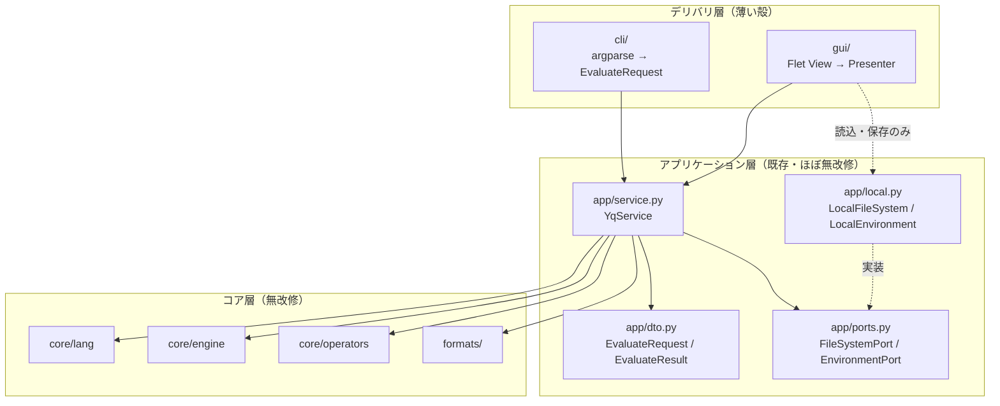
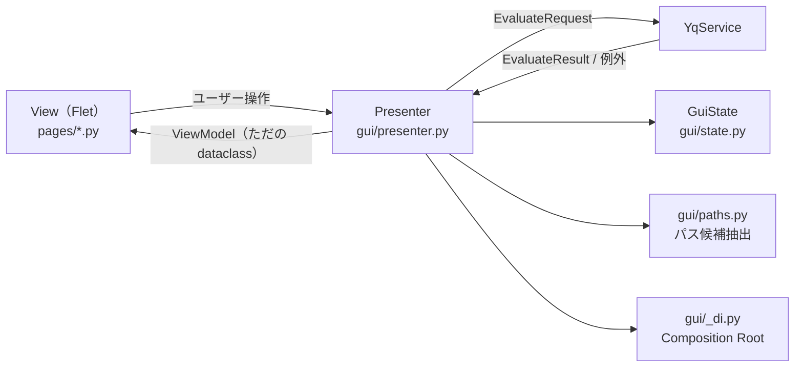
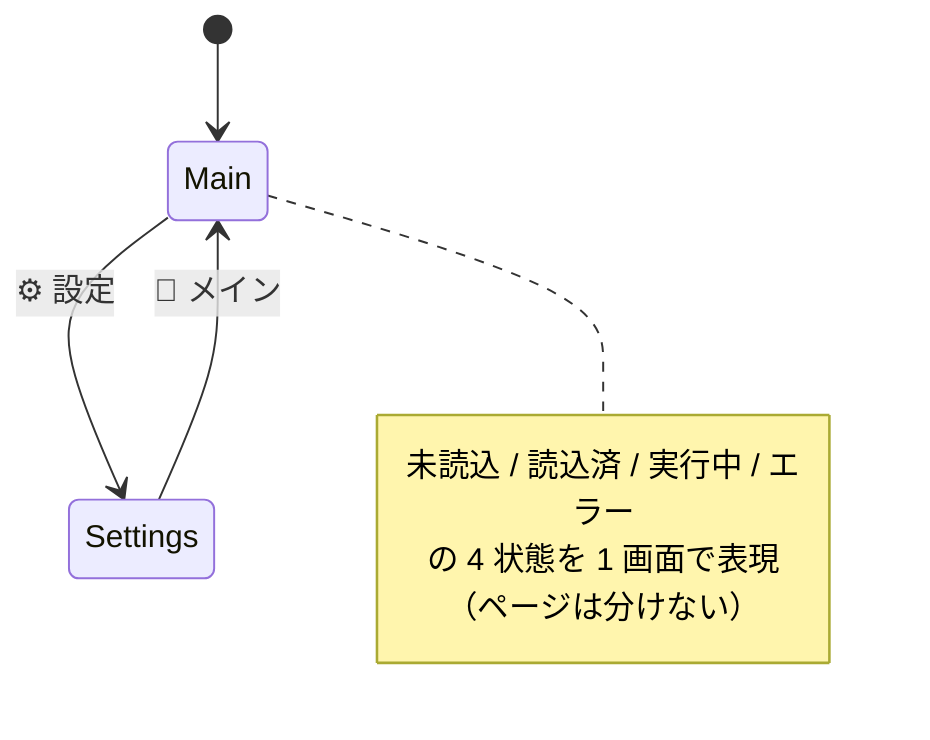
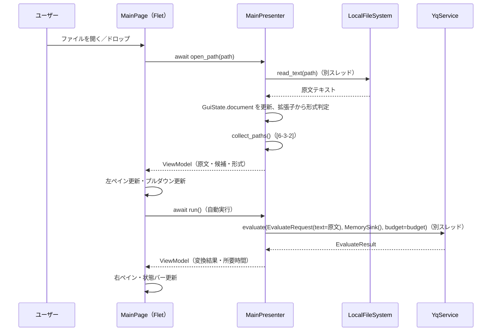
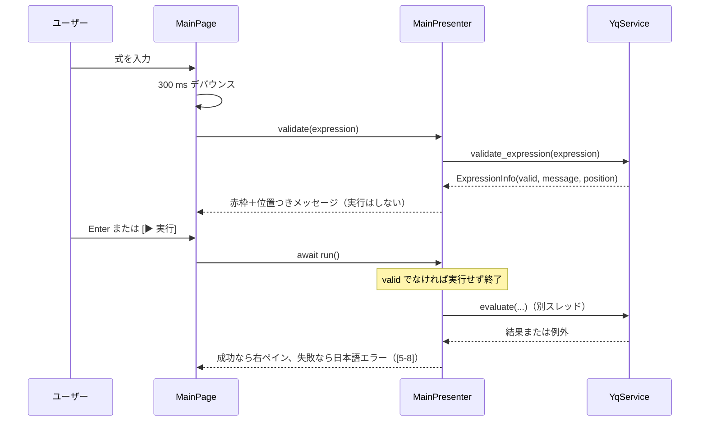
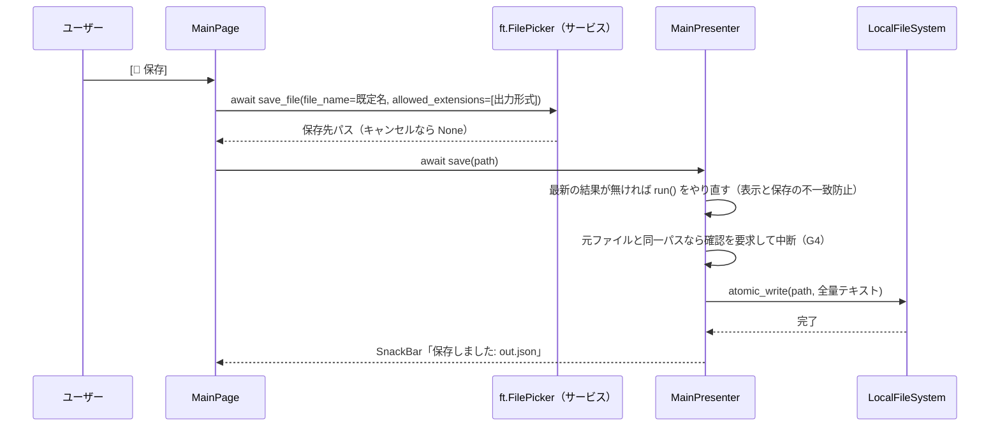
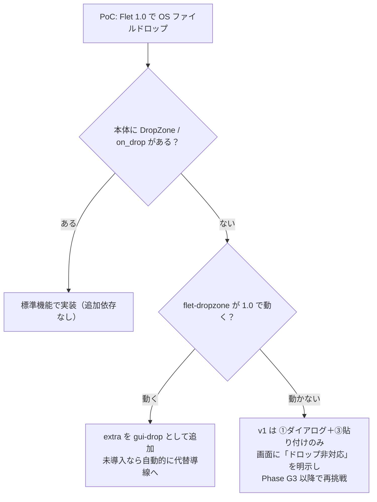
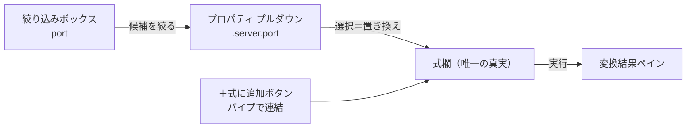

# yaqpy GUI アプリ 改修・デザイン計画書

| 項目 | 内容 |
|---|---|
| 文書 ID | 0919-02_31_design-yaqpy-gui |
| 版 | 第1.2版（自己評価で見つけた問題を修正済み。詳しくは[付録B](#付録b-自己評価ログ)） |
| 作成日 | 2026-09-19 |
| 対象 | [`31_dev-yaqpy/`](../31_dev-yaqpy/)（yaqpy v0.1.0、Library ＋ CLI）へ **デスクトップ GUI** を追加するための改修設計 |
| 参考実装 | [`13_ref-sgtao-yapilet/`](../13_ref-sgtao-yapilet/) の `gui/` パッケージ（Flet 製）／解説メモ [`0919-01_13_ref-sgtao-yapilet_code-explanation.md`](./0919-01_13_ref-sgtao-yapilet_code-explanation.md) |
| 前提資料 | [`0917-02_31_design-python-yq.md`](./0917-02_31_design-python-yq.md)（以下「基本設計書」）の 11 章（`YqService`）・13-1（GUI 拡張方針） |
| 本書の位置づけ | 基本設計書 13-1（tkinter 前提）を**上書きする** GUI 詳細設計。コア（`core/` `formats/`）の設計は変更しない |
| 実装状態 | **未着手**（本書は計画。コードはまだ 1 行も書いていない） |
| 実装プラン | [G0 PoC](./0919-03_31_yaqpy-gui-phaseG0.md)／[G1 骨格](./0919-04_31_yaqpy-gui-phaseG1.md)／[G2 フィルタ](./0919-05_31_yaqpy-gui-phaseG2.md)／[G3 保存・仕上げ](./0919-06_31_yaqpy-gui-phaseG3.md)（タスク単位の手順・コード骨格・テスト） |

> **読み方ガイド**
> - 何を作るのか知りたい人 → 「1」「2」「5-1」
> - 既存コードへの影響を知りたい人 → **「4」（改修一覧）** ← ここが本書の主題
> - GUI 実装担当 → 「5」「6」「付録A（スケルトン）」
> - yapilet を知っている人 → 「7」（流用と差分の対応表）
> - PM・レビュア → 「2-3」（受入基準）「8」（段階計画）「11」（リスク）「12」（未決事項）

---

## 目次

- [0. 確定事項と用語](#0-確定事項と用語)
- [1. 目的・スコープ・非目標](#1-目的スコープ非目標)
- [2. 要求事項と受入基準](#2-要求事項と受入基準)
- [3. アーキテクチャ](#3-アーキテクチャ)
- [4. 現行コードからの改修計画](#4-現行コードからの改修計画)
- [5. GUI 設計](#5-gui-設計)
- [6. 機能別詳細設計](#6-機能別詳細設計)
- [7. yapilet からの流用と差分](#7-yapilet-からの流用と差分)
- [8. 段階計画（Phase G0〜G3）](#8-段階計画phase-g0g3)
- [9. テスト戦略](#9-テスト戦略)
- [10. セキュリティ・リソース制限](#10-セキュリティリソース制限)
- [11. リスクと対策](#11-リスクと対策)
- [12. 未決事項](#12-未決事項)
- [付録A. 主要クラスのスケルトン](#付録a-主要クラスのスケルトン)
- [付録B. 自己評価ログ](#付録b-自己評価ログ)

---

## 0. 確定事項と用語

### 0-1. 確定事項（着手前に合意した内容）

| # | 論点 | 決定 | 設計への影響 |
|---|---|---|---|
| G1 | GUI フレームワーク | **Flet**（yapilet と同じ）。ただし**任意依存**とし、`pip install yaqpy[gui]` で入れる | `yaqpy` 本体の「実行時依存ゼロ」（基本設計書 D1）は**維持**。依存ゼロ検査テストは `src/yaqpy/gui/` を対象外にする（→ [4-5](#4-5-改修-d依存ゼロ検査テストの扱い)） |
| G2 | パッケージ構成 | **単一パッケージ＋extra**。`src/yaqpy/gui/` を追加し、`[project.optional-dependencies]` と `yaqpy-gui` スクリプトを足す | uv workspace への分割は**しない**。既存の import パス・テスト・ビルドへの影響が最小 |
| G3 | プロパティ候補（プルダウン） | **読み込んだ文書を走査して全パスを自動抽出**（深さ上限＋インクリメンタル絞り込みで件数を制御） | `paths` 演算子が現行 yaqpy に**未実装**（`path` / `del_paths` のみ）のため、Node ツリーを Python で走査する専用モジュールを新設（→ [6-3](#6-3-フィルタ機能)） |
| G4 | 保存機能の範囲 | **別名保存のみ**。元ファイルの上書き（CLI の `-i` 相当）は GUI では提供しない | 「開いたファイルを壊さない」を GUI の不変条件にできる（→ [12](#12-未決事項) Q3） |
| G5 | 対象 Flet 版 | **Flet 1.0 系**（2026-09-15 リリース）を前提にする | yapilet の GUI コード（Flet 0.85 世代 API）は**そのままでは動かない**。書き換え箇所を [7-2](#7-2-flet-085--10-の-api-差分書き換え表) に一覧化 |
| G6 | 対象 OS | Windows 11 を主、macOS / Linux は「動くはず」の扱い | ファイルドロップの実現手段が OS 依存になりうる（→ [6-1](#6-1-ファイルの受け取りオープン--ドロップ)） |
| G7 | 国際化 | UI 文言は**日本語のみ**（v1）。文言はモジュール定数に集約して後で差し替え可能にする | `gui/texts.py` を置く |
| G8 | 起動コマンド | **`yaqpy-gui`（専用コマンド）と `yaqpy --gui`（CLI のフラグ）の両方** | `cli/parser.py`・`cli/main.py` に小さな改修が入り、**`cli/main.py` だけが gui を遅延 import する例外**が 1 件生じる（→ [4-8](#4-8-改修-hcli-に---gui-を足す)） |

### 0-2. 用語

| 用語 | 意味 |
|---|---|
| オリジナル表示 | 開いたファイルの**生テキスト**をそのまま出すペイン（yaqpy を通さない） |
| 変換後表示 | 式（既定は `.`）を適用し、選んだ出力形式でエンコードした結果を出すペイン |
| フリー入力フィルタ | `.server.port` や `.items[] \| select(.price > 500)` のような **yq 式を直接書く**入力欄 |
| プロパティ選択フィルタ | 文書から自動抽出したパス候補を**プルダウンから選ぶ**入力（選ぶと式欄に反映される） |
| Presenter | View（Flet）と `YqService` の間に立つ、Flet 非依存のロジック。単体テストの主対象 |
| Intake | ファイルテキストを GUI に取り込む経路の抽象（ダイアログ／ドロップ／貼り付け） |

---

## 1. 目的・スコープ・非目標

### 1-1. 目的

CLI を知らない人でも、**YAML/JSON ファイルを開いて・中身を確かめて・欲しい部分だけ取り出して・別形式で保存する**までを、画面操作だけで完結できるようにする。

### 1-2. スコープ（v1 で作るもの）

1. ファイルを**開く／ドロップする**と、左にオリジナル、右に変換結果が出る
2. **フィルタ**：フリー入力（yq 式）と、プロパティのプルダウン選択の 2 系統
3. フィルタ・変換した結果の**ファイル保存**（別名保存）
4. 上記を支える：入出力形式の選択、エラー表示、設定（インデント・セキュリティ・タイムアウト）

### 1-3. 非目標（v1 で作らないもの）

| 非目標 | 理由 |
|---|---|
| 元ファイルの上書き（`-i` 相当） | G4。事故の影響が大きく、Undo を持たない v1 では危険 |
| 複数ファイルの同時読み込み（`eval-all`） | UI が一気に複雑になる。Phase G3 以降の候補 |
| 編集機能（オリジナルペインを直接書き換えて保存） | 「ビューア＋変換器」に絞る。編集はエディタの仕事 |
| Web／モバイル配布（Flet の web モード） | デスクトップのみ。ただし Flet なので後から選択肢は残る |
| シンタックスハイライト・行番号 | Flet に既製部品がなく自前実装コストが高い（→ [12](#12-未決事項) Q4） |

---

## 2. 要求事項と受入基準

### 2-1. 機能要求（FR）

| ID | 要求 | 出典 |
|---|---|---|
| G-FR-01 | ファイル選択ダイアログからファイルを開ける | 依頼「ファイルオープン」 |
| G-FR-02 | ウィンドウへファイルをドラッグ＆ドロップして開ける | 依頼「ドロップしたら」 |
| G-FR-03 | 開いたファイルの**オリジナルの内容**をそのまま表示する | 依頼「オリジナルの内容を表示する」 |
| G-FR-04 | 指定した**変換形式に合わせた変換結果**を同時に表示する | 依頼「変換形式に合わせて変換値も表示」 |
| G-FR-05 | 入力形式は拡張子から自動判定し、手動でも変更できる | G-FR-04 の前提 |
| G-FR-06 | **フリー入力**で yq 式を書いてフィルタできる | 依頼「フィルタはフリー入力」 |
| G-FR-07 | **プルダウン**でプロパティ（パス）を選んでフィルタできる | 依頼「プルダウンでプロパティ選択」 |
| G-FR-08 | 式の構文エラーを、実行前に位置つきで表示する | 既存 `validate_expression` の活用 |
| G-FR-09 | フィルタ・変換した結果を**別名でファイル保存**できる | 依頼「結果をファイルに保存」 |
| G-FR-10 | 保存時の既定ファイル名・拡張子が出力形式と一致する | G-FR-09 の使い勝手 |
| G-FR-11 | エラー（構文・形式・セキュリティ・制限超過）を日本語で表示する | 既存 `errors.py` の活用 |
| G-FR-12 | 設定（インデント、env/file 許可、タイムアウト）を変更できる | セキュリティ既定を strict にするため |

### 2-2. 非機能要求（NFR）

| ID | 要求 | 目安 |
|---|---|---|
| G-NFR-01 | 変換中に UI が固まらない | Flet 1.0 は**同期ハンドラがイベントループを止める**ため、評価は必ず別スレッドへ退避（→ [5-7](#5-7-非同期実行とキャンセル)） |
| G-NFR-02 | 実行をキャンセルできる | `StepBudget.cancel()` を GUI から呼べるようにする（→ [4-2](#4-2-改修-b評価のキャンセル手段をサービスに通す)） |
| G-NFR-03 | 大きいファイルでも操作できる | 表示は先頭 N 行（既定 5,000 行）に丸め、保存は全量 |
| G-NFR-04 | `yaqpy` 本体の実行時依存ゼロを壊さない | `gui/` を optional-dependencies に隔離（G1） |
| G-NFR-05 | GUI ロジックは Flet なしで単体テストできる | Presenter を Flet 非依存にする（→ [9](#9-テスト戦略)） |
| G-NFR-06 | 既定は安全側 | `SecurityPolicy.strict()` ＋ タイムアウト 10 秒（→ [10](#10-セキュリティリソース制限)） |

### 2-3. 受入基準（v1 完了の定義）

| # | シナリオ | 期待 |
|---|---|---|
| A1 | `examples/sample.yaml` をダイアログで開く | 左ペインにコメント込みの原文、右ペインに YAML の変換結果、状態バーに「1 document / xx ms」 |
| A2 | 出力形式を `json` に変える | 右ペインだけが JSON に変わり、左ペインは変わらない |
| A3 | プルダウンから `.server.port` を選ぶ | 式欄が `.server.port` になり、右ペインが `8080` になる |
| A4 | 式欄に `.items[] \| select(.price > 500)` と入力 | 右ペインに `name: book` / `price: 980` 相当が出る |
| A5 | 式欄に `.server.(` と入力（構文エラー） | 実行せずに式欄が赤くなり、位置つきエラーが出る |
| A6 | `[保存]` を押して `out.json` を指定 | 右ペインと同じ内容のファイルができ、元ファイルは変化しない |
| A7 | ファイルをウィンドウにドロップ | A1 と同じ状態になる（ドロップ不可環境では代替導線が明示される） |
| A8 | 壊れた YAML を開く | 左ペインには原文が出て、右ペインにエラー（行・列つき）が出る。アプリは落ちない |

---

## 3. アーキテクチャ

### 3-1. 全体像

GUI は **CLI と同じ立場の「薄い殻」**です。業務ロジックは既存の `YqService` にあり、GUI はそれを呼ぶだけにします（yapilet と同じ構え）。



### 3-2. GUI 内部の層（MVP パターン）

Flet に依存してよいのは **View だけ**です。Presenter は「Flet の型を一切 import しない」を規約にします（G-NFR-05）。



| レイヤ | ファイル | Flet 依存 | テスト |
|---|---|---|---|
| View | `gui/app.py`, `gui/pages/*.py` | **あり** | 手動テスト（[9-3](#9-3-手動テストシナリオview-の担保)） |
| Presenter | `gui/presenter.py` | なし | unittest（主戦場） |
| 状態 | `gui/state.py` | なし | unittest |
| 部品 | `gui/paths.py`, `gui/intake.py`, `gui/errors_ja.py`, `gui/texts.py` | なし | unittest |
| 合成 | `gui/_di.py` | なし | 依存方向テスト |

### 3-3. 依存方向の規約（既存の `tests/unit/test_architecture.py` に追記）

```text
gui/pages/*   →  gui/presenter, gui/state, gui/texts, flet   （app/ core/ を直接 import しない）
gui/presenter →  app/, options, errors, gui/paths, gui/intake,
                 core/engine/limits（StepBudget の型注釈だけ）         （flet を import しない）
gui/_di       →  app/, gui/*                                 （flet を import しない）
core/, formats/, app/ →  gui/ を import しない（逆流禁止）
cli/                  →  gui/ を import しない。ただし cli/main.py だけは `--gui` のために
                         関数の中で遅延 import してよい（唯一の例外。理由と縛り方は 4-8）
```

---

## 4. 現行コードからの改修計画

**本章が本書の主題です。**「どのファイルを・なぜ・どう変えるか」と「変えないもの」をはっきりさせます。

### 4-0. 改修サマリ

| 種別 | 対象 | 規模 | 必須 |
|---|---|---|---|
| A | `pyproject.toml`（extra ＋ スクリプト） | 小（約 10 行） | 必須 |
| B | `app/service.py`（評価バジェットを外から渡せるようにする＝キャンセル） | 小（約 15 行） | 必須 |
| C | `app/dto.py`（`EvaluateResult` に解決済みの入出力形式を持たせる） | 小（約 5 行） | 推奨 |
| D | `tests/unit/test_architecture.py`（依存ゼロ検査の除外と GUI 依存方向） | 小 | 必須 |
| E | `src/yaqpy/gui/` 新規 13 ファイル | 大（約 1,280 行） | 必須 |
| F | `README.md` / `USAGE.ja.md`（GUI の節） | 小 | 必須 |
| G | `core/` `formats/` | **改修なし** | — |
| H | `cli/parser.py` / `cli/main.py`（`--gui` フラグ）＋ 依存方向テストの例外 1 件 ＋ テスト | 小（本体 約 20 行、テスト 約 100 行） | 依頼により追加（G8） |

> **重要**：コア層（式言語・評価器・演算子・フォーマット）は 1 行も触りません。GUI のために必要になった機能は、すべて `app/` より外側で吸収します。

### 4-1. 改修 A：`pyproject.toml`

```toml
# 追加（既存の dependencies = [] はそのまま。本体の依存ゼロは維持）
[project.optional-dependencies]
gui = ["flet>=1.0,<2"]

[project.scripts]
yaqpy = "yaqpy.cli.main:main"
yaqpy-gui = "yaqpy.gui.app:main_entry"   # 追加
```

| 論点 | 決定 |
|---|---|
| `flet` のバージョン指定 | `>=1.0,<2`。yapilet の `>=0.21` は Flet 1.0 の破壊的変更（[7-2](#7-2-flet-085--10-の-api-差分書き換え表)）を吸収できないため踏襲しない |
| `yaqpy-gui` を flet 未導入で起動したら | `gui/app.py` 冒頭で `ImportError` を捕まえ、`pip install "yaqpy[gui]"` を案内して終了コード 1（基本設計書 13-1 の tkinter 版と同じ思想） |
| `yaqpy --gui` でも起動できるようにするか | **する**（G8）。`[project.scripts]` には足さず、`cli/` 側のフラグとして実装する（→ [4-8](#4-8-改修-hcli-に---gui-を足す)） |
| ビルド対象 | `uv_build` の既定（`src/yaqpy/**`）に自動で含まれるため追加設定は不要 |

### 4-2. 改修 B：評価のキャンセル手段をサービスに通す

**問題**：`YqService.evaluate()` は内部の `make_env()` で `StepBudget` を作って握ってしまうため、呼び出し側（GUI）が `StepBudget.cancel()` を呼べません。`StepBudget.cancel()` 自体は**既に実装済み**（`core/engine/limits.py`）なので、**経路を通すだけ**で済みます。

```python
# app/service.py（差分イメージ）
    def make_env(self, options: Options, budget: StepBudget | None = None) -> EvalEnv:
        ...
        budget=budget or StepBudget(options.limits.max_steps, options.limits.timeout_seconds),

    def evaluate(self, request: EvaluateRequest, sink: Any,
                 *, budget: StepBudget | None = None) -> EvaluateResult:
        ...
        env = self.make_env(options, budget)
```

| 項目 | 内容 |
|---|---|
| 後方互換 | 引数はキーワード専用かつ既定 `None`。CLI・API・既存テストは無改修で動く |
| GUI 側の使い方 | 実行のたびに `budget = StepBudget(...)` を作って保持し、`[中止]` で `budget.cancel()` |
| 効き方 | `Navigator.evaluate` の各ステップで `tick()` が見るので**協調的に**止まる。巨大ファイルの**デコード中は止まらない**（→ [11](#11-リスクと対策) R4） |
| 代替案（不採用） | `YqService` にキャンセル用フィールドを持たせる案は、`YqService` がスレッド間共有される前提（ステートレス）を壊すので不採用 |

### 4-3. 改修 C：`EvaluateResult` に解決済み形式を持たせる

**問題**：GUI は「拡張子から自動判定された入力形式」を状態バーとプルダウンに反映したいのですが、判定結果（`_resolve_formats` の戻り）が外に出てきません。GUI 側で `formats.from_filename()` を再実装すると**二重の真実**になります。

```python
# app/dto.py（差分イメージ）
@dataclass(frozen=True, slots=True)
class EvaluateResult:
    output: str | None
    printed_anything: bool
    document_count: int
    warnings: tuple[str, ...]
    elapsed_seconds: float
    input_format: str = ""     # 追加：実際に使われた入力形式
    output_format: str = ""    # 追加：実際に使われた出力形式
```

既定値つきで追加するため、既存の生成箇所・利用箇所（CLI / テスト）は無改修です。

### 4-4. 改修しないが「そのまま使える」ことを確認した既存機能

設計の前提が本当に成り立つか、実コードを読んで確認した結果です。

| 使いたいこと | 使う既存機能 | 確認結果 |
|---|---|---|
| メモリ上のテキストを評価する | `InputSource(name, text)` | `text is not None` なら FS を触らずにその文字列を使う（`service._read_input`）。**GUI はファイルを読むだけで、評価は完全にメモリ内**で行える |
| 拡張子から入力形式を自動判定 | `EvaluateRequest(input_format="auto")` | `_resolve_formats` が `request.inputs[0].name` を `formats.from_filename()` にかける。**`name` に実ファイル名、`text` に中身**を入れれば両立する |
| 結果を文字列で受け取る | `app/printer.MemorySink` | `evaluate(request, MemorySink())` の戻り `result.output` が文字列 |
| 形式の一覧 | `YqService.list_formats()` | `FormatsInfo(input_formats, output_formats)`。**props は出力専用**（`decoder_factory is None`）なので入力プルダウンには出さない |
| 式の事前検証 | `YqService.validate_expression()` | `ExpressionInfo(valid, message, position)` を返す。位置つき下線表示にそのまま使える |
| 安全なファイル書き込み | `app/local.LocalFileSystem.atomic_write()` | 一時ファイル → `os.replace` の原子的置換。**保存はこれを再利用**し、GUI 側で `open()` を書かない |
| セキュリティ既定 | `Options.security` | 既定 `SecurityPolicy.strict()`（env/file/system すべて不許可）。GUI の既定もこれ |
| 実行時間の計測 | `EvaluateResult.elapsed_seconds` | 状態バーへそのまま |

> **`Yq` ファサード（`api.py`）は使いません。** `Yq.evaluate()` は入力名を `"<text>"` に固定するため、拡張子からの自動判定ができないからです。CLI と同じく **`YqService` を直接**使います。

### 4-5. 改修 D：依存ゼロ検査テストの扱い

現行 `tests/unit/test_architecture.py` の `test_only_standard_library` は、`src/yaqpy/**` の全 `.py` を走査して「import の先頭要素が `yaqpy` か標準ライブラリであること」を検査しています。ここに `flet` が入ると**必ず落ちる**ため、次のとおり改めます。

| 変更 | 内容 | 現状 |
|---|---|---|
| 除外 | `test_only_standard_library` の対象から `src/yaqpy/gui/` を除外し、「**`gui/` 以外は依存ゼロ**」というより強い主張のテストにする | **要改修**（現状は全ファイルが対象） |
| 追加1 | `gui/` が import してよい外部パッケージは `flet`（＋ドロップ採用時は `flet_dropzone`）**のみ**、というホワイトリスト検査 | 新規 |
| 追加2 | `core/` `formats/` が `yaqpy.gui` を import していない（逆流禁止）検査 | **要追記**。`FORBIDDEN` 表には `yaqpy.app` / `yaqpy.api` / `yaqpy.cli` の行に既に `"yaqpy.gui"` が入っているが、`core.*` と `formats` の行には無い |
| 追加3 | `gui/presenter.py` `gui/state.py` `gui/paths.py` `gui/intake.py` `gui/errors_ja.py` `gui/_di.py` が `flet` を import していない検査（G-NFR-05 の担保） | 新規 |
| 追加4 | `cli/main.py` の `yaqpy.gui` の import は**関数の中だけ**（モジュール先頭では禁止）。`FORBIDDEN` の例外表 `ALLOWED_EXCEPTIONS` に `("yaqpy.cli.main", "yaqpy.gui")` を 1 件だけ載せる代わりに、遅延であることを別テストで縛る | 新規（改修 H。→ [4-8](#4-8-改修-hcli-に---gui-を足す)） |

### 4-6. 改修 E：新規ファイル一覧

```text
src/yaqpy/gui/
├── __init__.py          （  5 行）バージョンと公開名だけ
├── app.py               （ 60 行）flet 未導入ガード付きのエントリポイント
├── _run.py              （ 90 行）flet を import する実体（ページ合成・ウィンドウ設定）
├── _di.py               （ 60 行）Composition Root：YqService / LocalFileSystem の生成
├── state.py             （ 80 行）GuiState（開いているファイル、式、形式、設定）
├── presenter.py         （260 行）業務ロジック：開く／変換／フィルタ／保存／検証
├── paths.py             （150 行）Node ツリー → プロパティパス候補（G3）
├── intake.py            （ 90 行）ファイル取り込みの抽象（ダイアログ／ドロップ／貼り付け）
├── errors_ja.py         （ 90 行）YqError 派生 → 日本語メッセージ＋対処ヒント
├── texts.py             （ 60 行）UI 文言の集約
└── pages/
    ├── __init__.py      （  3 行）
    ├── main_page.py     （220 行）2 ペイン本体
    └── settings_page.py （110 行）設定
```

合計およそ **1,280 行**（うち Flet 依存は `_run.py` と `pages/` の約 430 行）。

### 4-7. 改修 F：ドキュメント

| ファイル | 追記内容 |
|---|---|
| `31_dev-yaqpy/README.md` | 「GUI」節：`uv sync --extra gui` → `uv run yaqpy-gui`、画面イメージ、依存ゼロ方針との関係の一文 |
| `31_dev-yaqpy/USAGE.ja.md` | GUI の操作手順（開く→フィルタ→保存）と、CLI との対応表（「GUI のこの操作 = CLI のこのコマンド」） |
| `31_dev-yaqpy/docs/` | 本書の写しを置く（基本設計書と同じ運用） |

### 4-8. 改修 H：CLI に --gui を足す

依頼により、`yaqpy-gui` に加えて **`uv run yaqpy --gui`** でも起動できるようにします（G8）。

**変更内容（実コードで確認した規模）**

| ファイル | 内容 | 差分 |
|---|---|---|
| `cli/parser.py` | misc グループに `--gui`（`store_true`）を追加 | +2 行 |
| `cli/main.py` | `_launch_gui()` を追加し、`ns.version` 判定の**直後**で `ns.gui` なら委譲する | +18 行 |
| `tests/unit/test_architecture.py` | 例外表 `ALLOWED_EXCEPTIONS` と、遅延 import を縛るテスト | +69 / -5 行（T1-5 の分を含む） |
| `tests/unit/test_cli_gui_flag.py` | 新規。GUI は起動せず、モックで委譲・終了コード・併用拒否を検証（12 件） | 新規 |
| `tests/acceptance/test_cli.py` | サブプロセスで `--help` への掲載と併用拒否を確認（3 件） | +20 行 |

**設計の決めごと**

| 決めごと | 内容 | 理由 |
|---|---|---|
| gui の import は**関数の中で遅延** | `cli/main.py` の先頭では import しない | flet 未導入でも CLI 本体が動く。`yaqpy.gui.app` 自体は flet をモジュール先頭で import しないので、遅延 import は常に安全 |
| 併用は**エラー** | `--gui` と式・ファイル（`--expression` / `--from-file` を含む）を一緒に渡すと終了コード 1 | 黙って無視すると `yaqpy --gui a.yaml` で「開いてくれる」と誤解させる（→ Q8） |
| `-V` が優先 | version 判定の直後に置く | `yaqpy --gui -V` はバージョン表示で終わる |
| stdin を消費しない | `resolve_invocation` より前で分岐 | `echo 'a: 1' \| yaqpy --gui` でパイプ入力に触れない（実測で確認） |
| `gui_app.main_entry(...)` を**モジュール属性経由**で呼ぶ | `from ... import main_entry` にしない | テストで `mock.patch("yaqpy.gui.app.main_entry")` が効く |

**依存方向の例外（本改修で唯一の設計上の代償）**

`cli/main.py` が gui を import すると、既存の依存方向テストが落ちます（実測）。

```text
FAIL: test_dependency_direction (module='yaqpy.cli.main', imported='yaqpy.gui')
AssertionError: True is not false : yaqpy.cli.main must not import yaqpy.gui
```

`FORBIDDEN["yaqpy.cli"]` が `yaqpy.gui` を禁じており、`imports_of()` は関数の中の import も拾うためです。**検査を消さず、例外を 1 件だけ明示**して通します。

| 検討した案 | 判断 | 理由 |
|---|---|---|
| A. **例外表に 1 件載せ、遅延であることを別テストで縛る** | **採用** | 例外が表に見える。`cli/main.py` の先頭で import するとテストが落ちる。`args.py` / `parser.py` が gui に触れた場合は従来のテストがそのまま検出する |
| B. `importlib.import_module("yaqpy.gui.app")` の文字列で import する | 不採用 | 静的検査を**すり抜けるための書き方**になり、依存が見えなくなる |
| C. コンポジションルート（cli と gui を注入で結ぶ新モジュール）を作り、`yaqpy` の入口を差し替える | 不採用 | 依存は最もきれいだが、`[project.scripts]` と `python -m yaqpy` の入口が変わり、フラグ 1 つに対して過剰 |
| D. `FORBIDDEN` から `cli → gui` の禁止を外す | 不採用 | `cli/args.py` や `parser.py` まで gui を import できてしまう |

**実測した確認結果**（プランの置換ブロックを機械的に抽出してクリーンなコピーへ適用し、実行）

| 確認 | 結果 |
|---|---|
| 置換ブロック 10 か所（T1-5 の 2 ＋ T1-14 の 8）が**それぞれ 1 回だけ**適用できる | OK |
| 単体テスト全体 | 118 件パス（既存 101 ＋ 追加 17） |
| acceptance 全体 | 49 件パス（うち新規 3） |
| 突然変異：`cli/main.py` の先頭に `from yaqpy.gui import app` を足す | `test_cli_reaches_gui_only_lazily` が落ちる |
| 突然変異：`cli/args.py` に `import yaqpy.gui` を足す | `test_dependency_direction` が落ちる |
| flet 未導入で `python -m yaqpy --gui` | 導入案内を出して終了コード 1 |
| `python -m yaqpy --gui .a` | `cannot be combined ...` で終了コード 1 |
| `echo 'a: 1' \| python -m yaqpy .a`（既存の使い方） | `1`、終了コード 0（影響なし） |

---

## 5. GUI 設計

### 5-1. 画面レイアウト

**メイン画面（1 画面完結）**

```text
┌────────────────────────────────────────────────────────────────────────────────┐
│ 📄 [ファイルを開く]  examples/sample.yaml  (2.1 KB)          [✕ 閉じる]         │
├────────────────────────────────────────────────────────────────────────────────┤
│ 入力形式 [yaml ▼(auto)]  出力形式 [json ▼]  インデント [2 ▲▼]  [□ 整形(-P)]     │
├────────────────────────────────────────────────────────────────────────────────┤
│ プロパティ [.server.port          ▼] [🔍 絞り込み: port     ]  [＋ 式に追加]     │
│ 式         [.server.port                                     ] [▶ 実行][■ 中止] │
│            ↑ 構文エラー時はここが赤くなり、下に「7 文字目: 閉じ括弧がありません」  │
├─────────────────────────────────────┬──────────────────────────────────────────┤
│ オリジナル（yaml・読み取り専用）      │ 変換結果（json）           [📋] [💾 保存] │
│ ------------------------------------ │ ---------------------------------------- │
│ # サーバー設定                        │ 8080                                     │
│ server:                              │                                          │
│   port: 8080 # 開発用                 │                                          │
│   hosts: [a, b]                      │                                          │
│   ...                                │                                          │
├─────────────────────────────────────┴──────────────────────────────────────────┤
│ ✅ 1 document / 3.2 ms / 出力 5 bytes       yaml → json           [⚙ 設定]      │
└────────────────────────────────────────────────────────────────────────────────┘
```

**ドロップ中**：ウィンドウ全体に半透明のオーバーレイと「ここにファイルをドロップ」を出す。

**設定画面**（yapilet の `SettingsPage` と同じ独立ページ）

```text
┌────────────────────────────────────────────────────────────────┐
│ ⚙ 設定                                                         │
├────────────────────────────────────────────────────────────────┤
│ 【セキュリティ】既定はすべて不許可（安全側）                     │
│  [□] env / strenv 演算子を許可（環境変数を読めるようになります）  │
│  [□] load / loadstr 演算子を許可（他ファイルを読めるようになります）│
│  ※ system 演算子は GUI では提供しません                         │
├────────────────────────────────────────────────────────────────┤
│ 【実行】                                                        │
│  タイムアウト [10] 秒    最大入力サイズ [50] MiB                 │
│  表示行数の上限 [5000] 行（超過分は表示のみ省略。保存は全量）     │
├────────────────────────────────────────────────────────────────┤
│ 【YAML 出力】                                                   │
│  [□] シーケンスをコンパクトにインデント  [□] `---` を出力しない   │
├────────────────────────────────────────────────────────────────┤
│ 【表示】 [□] ダークテーマ                                       │
└────────────────────────────────────────────────────────────────┘
```

### 5-2. 画面遷移

yapilet の「下部ナビゲーション＋ページ差し替え」方式をそのまま踏襲します（実装が単純でテストしやすいため）。ページは 2 つだけです。



### 5-3. 部品一覧（Flet 1.0 の型名）

| 領域 | 部品 | Flet 1.0 の型 | 備考 |
|---|---|---|---|
| ファイルバー | 開くボタン | `ft.Button(content="ファイルを開く", icon=ft.Icons.FOLDER_OPEN)` | 0.28 の `ElevatedButton(text=...)` は廃止 |
| 〃 | ファイル選択 | `ft.FilePicker()`（**サービス**） | `page.overlay` ではなく `page.services` に登録。`await picker.pick_files(...)` |
| 形式バー | 入出力形式 | `ft.Dropdown(on_select=...)` | 1.0 で `on_change` は「編集可能モードの文字入力時」に発火。**選択は `on_select`** |
| 〃 | インデント | `ft.TextField(input_filter=ft.NumbersOnlyInputFilter())` | |
| フィルタ | プロパティ候補 | `ft.Dropdown(editable=True, on_select=..., on_text_change=...)` | 選択は `on_select`、**絞り込みは `on_text_change`**（[6-3](#6-3-フィルタ機能)） |
| 〃 | 式入力 | `ft.TextField(multiline=False, on_submit=..., on_change=...)` | Enter で実行、300 ms デバウンスで検証 |
| 〃 | 実行・中止 | `ft.Button` / `ft.IconButton` | 実行中は実行を無効化し中止を有効化 |
| ペイン | テキスト表示 | `ft.TextField(read_only=True, multiline=True, text_style=ft.TextStyle(font_family="Consolas"))` | `ft.Text(selectable=True)` より選択・スクロール・等幅の扱いが素直 |
| 〃 | 保存 | `ft.Button` → `await ft.FilePicker().save_file(...)` | |
| 〃 | コピー | `await ft.Clipboard().set(text)` | 1.0 で `page.set_clipboard()` は廃止 |
| 状態バー | 結果・エラー | `ft.Row([ft.Icon, ft.Text])` | 成功=緑、警告=黄、エラー=赤 |
| 実行中 | 進捗 | `ft.ProgressBar(visible=...)` | |
| ドロップ | 受け皿 | [6-1](#6-1-ファイルの受け取りオープン--ドロップ) 参照 | 実現手段が未確定のため抽象化する |
| 通知 | 一時メッセージ | `ft.SnackBar` | 保存完了など |

### 5-4. 状態管理（`gui/state.py`）

yapilet の `AppStore`（`api_key` と `mock_echo` だけの小さな dataclass）を踏襲しつつ、yaqpy では扱う状態が多いので**役割で 3 つに割ります**。

```python
@dataclass(slots=True)
class DocumentState:          # 開いている文書
    path: str | None = None           # None なら「貼り付け」由来
    original_text: str = ""
    detected_format: str = ""         # 拡張子からの判定結果
    byte_size: int = 0

@dataclass(slots=True)
class QueryState:             # 式と形式の設定
    expression: str = "."
    input_format: str = "auto"
    output_format: str = "auto"
    indent: int = 2
    pretty_print: bool = False

@dataclass(slots=True)
class SettingsState:          # 設定画面の値（v1 ではセッション内のみ保持）
    allow_env: bool = False
    allow_file: bool = False
    timeout_seconds: float = 10.0
    max_input_mib: int = 50
    max_display_lines: int = 5000
    dark_theme: bool = False

@dataclass(slots=True)
class GuiState:
    document: DocumentState = field(default_factory=DocumentState)
    query: QueryState = field(default_factory=QueryState)
    settings: SettingsState = field(default_factory=SettingsState)
    running: bool = False
```

| 論点 | 決定 |
|---|---|
| 状態の所有者 | `GuiState` のインスタンスは起動時に 1 個だけ作り、Presenter と各ページが**同じ参照**を持つ（yapilet と同じ） |
| View → 状態 | 入力のたびに `on_change` で `GuiState` に書き戻す（yapilet の `_on_api_key_change` と同じ流儀） |
| 状態 → `Options` | Presenter の `build_options()` が `GuiState` から**毎回新しい frozen `Options`** を作る（`Options` は不変なので使い回さない） |
| 永続化 | v1 では**しない**。Phase G3 で `ft.SharedPreferences()`（1.0 の新サービス）を検討（→ [12](#12-未決事項) Q5） |

### 5-5. Composition Root（`gui/_di.py`）

yapilet の `_di.py` と同じ役割（「pages が業務層を直接 import しない」ための唯一の結節点）です。

```python
def make_service() -> YqService:
    return YqService(LocalFileSystem(), LocalEnvironment())

def make_presenter(state: GuiState) -> MainPresenter:
    return MainPresenter(service=make_service(), fs=LocalFileSystem(), state=state)

def available_input_formats() -> list[str]:   # props を除いた入力可能形式
    return ["auto", *make_service().list_formats().input_formats]

def available_output_formats() -> list[str]:
    return ["auto", *make_service().list_formats().output_formats]
```

> yapilet では「Mock か本物か」を `_di.py` の 1 行で切り替えていました。yaqpy に HTTP は無いので、同じ場所で切り替えるのは **FileSystemPort**（`LocalFileSystem` / `SandboxFileSystem`）にします。テストでは `InMemoryFileSystem` を差し込めます。

### 5-6. 主要シーケンス

**(1) ファイルを開いて変換するまで**



**(2) 式を入力してからの検証と実行**



**(3) 保存**



### 5-7. 非同期実行とキャンセル

**Flet 1.0 の最重要の注意点**：0.28 までは同期イベントハンドラがスレッドプールで動いていましたが、**1.0 ではイベントループ上で直接動く**ため、重い処理を書くと UI が固まります（進捗バーすら出ません）。yaqpy の評価は CPU 律速なので、必ず退避します。

| 処理 | 実行方法 | 理由 |
|---|---|---|
| ファイル読み込み | `await asyncio.to_thread(fs.read_text, path)` | ディスク I/O（数十 MiB ありうる） |
| デコード＋評価＋エンコード | `await asyncio.to_thread(self._evaluate_sync, request, budget)` | CPU 律速。**ここが最重要** |
| 保存 | `await asyncio.to_thread(fs.atomic_write, path, text)` | ディスク I/O |
| 式の構文検証 | そのままループ上で可 | 字句解析＋構文解析のみで軽い。ただし 300 ms デバウンス |
| 候補パス抽出 | 文書が 1 MiB 超なら `to_thread` | 木の走査 |

```python
# presenter.py（骨子）
async def run(self) -> RunViewModel:
    if self.state.running:                      # 二重実行の防止
        return self._vm_busy()
    self.state.running = True
    request = self._build_request()
    self._budget = self._service.new_budget(request.options)   # 改修 B で通した経路
    try:
        result = await asyncio.to_thread(self._evaluate_sync, request, self._budget)
    except Exception as e:                      # 画面を落とさない
        return self._vm_error(e)                # errors_ja.py で日本語化
    finally:
        self.state.running = False
        self._budget = None
    return self._vm_success(result)

def cancel(self) -> None:
    if self._budget is not None:
        self._budget.cancel()                   # 改修 B で通した経路
```

| 論点 | 決定 |
|---|---|
| 二重実行 | `state.running` フラグで抑止し、実行中は `[▶ 実行]` を無効化 |
| 古い結果の追い越し | `running` フラグが同時実行を 1 本に抑えるため、通し番号での追い越し判定は**置かない**（到達しないコードを作らない） |
| キャンセルの効き方 | `StepBudget.cancel()` は評価ステップの境界で効く。**デコード中は効かない**（→ [11](#11-リスクと対策) R4） |
| `page.run_task` との使い分け | UI から起動する非同期処理は Flet の `async def` ハンドラで書き、その中で `asyncio.to_thread`。`page.run_task` は「投げっぱなし」用途のみ |

### 5-8. エラー表示のマッピング（`gui/errors_ja.py`）

既存の例外階層（`errors.py`）は `code` と付加情報（`position` / `line` / `column` / `capability` / `limit`）を持っているので、それを**そのまま**画面の出し分けに使います。

| 例外 | `code` | 表示場所 | 文言（例） | 対処ヒント |
|---|---|---|---|---|
| `ExpressionSyntaxError` | `expression_syntax` | 式欄の下（赤） | 「式の 7 文字目でエラー：閉じ括弧がありません」 | 該当位置に `^` を出す |
| `YamlSyntaxError` | `yaml_syntax` | 右ペイン（赤） | 「YAML の 12 行 3 列でエラー：…」 | 「入力形式の選択が違うかもしれません」 |
| `UnknownFormatError` | `unknown_format` | 状態バー | 「形式 'xml' には対応していません」 | 使える形式を併記 |
| `FormatError` | `format` | 右ペイン | 「読み込みに失敗しました：…」 | — |
| `SecurityError` | `security` | 右ペイン＋導線 | 「この式は env を使いますが、許可されていません」 | **[設定を開く] ボタン**を出し、`capability` に応じた該当スイッチへ誘導 |
| `EvaluationLimitError` | `evaluation_limit` | 状態バー | `limit="timeout_seconds"` →「時間切れ（10 秒）」／`limit="cancelled"` →「中止しました」 | 前者はタイムアウト延長を案内 |
| `EvaluationError` | `evaluation` | 右ペイン | 「評価エラー：…（演算子 `select`）」 | `operator` / `path` があれば併記 |
| 想定外の例外 | — | 右ペイン | 「想定外のエラーが発生しました」＋折りたたみでトレース | 「不具合として報告してください」 |

> **原則**：例外で GUI を落とさない。Presenter の公開メソッドはすべて `try/except Exception` で包み、ViewModel の `error` フィールドに畳んで返します（yapilet の `Result` オブジェクトパターンと同じ思想）。

---

## 6. 機能別詳細設計

### 6-1. ファイルの受け取り（オープン ／ ドロップ）

**G-FR-01 / G-FR-02**

#### 6-1-1. 3 つの取り込み経路を 1 つの口にまとめる

ドロップの実現手段が環境依存なので、**取り込み口を抽象化**して、どの経路でも同じ処理に合流させます。

```python
# gui/intake.py
@dataclass(frozen=True, slots=True)
class IntakeItem:
    name: str          # ファイル名（形式の自動判定に使う。貼り付けなら ""）
    text: str
    origin: str        # "dialog" | "drop" | "paste"

class IntakeError(Exception): ...

def from_path(fs: FileSystemPort, path: str, max_bytes: int) -> IntakeItem: ...
def from_text(text: str, name: str = "") -> IntakeItem: ...
```

| 経路 | 実装 | 可用性 |
|---|---|---|
| ① ダイアログ | `ft.FilePicker().pick_files(allowed_extensions=["yaml","yml","json","toon","properties"])` | **確実**（Flet 標準・全 OS） |
| ② ドロップ | 下記 6-1-2 | **要検証** |
| ③ 貼り付け | 左ペインが空のとき「ここに貼り付け」モードにし、テキスト入力を受ける | **確実** |

#### 6-1-2. ドロップの実現方針（重要・要 PoC）

調査した事実：

| 事実 | 出典 |
|---|---|
| Flet の `Draggable` / `DragTarget` は**アプリ内のドラッグ専用**で、OS からのファイルドロップには使えない | [Flet Drag and Drop cookbook](https://flet.dev/docs/cookbook/drag-and-drop/) |
| 「OS からファイルをドロップしたい」は長年の要望で、コミュニティ拡張 **flet-dropzone**（Flutter の `desktop_drop` をラップ）が事実上の解 | [flet-dev/flet#112](https://github.com/flet-dev/flet/issues/112)、[#265](https://github.com/flet-dev/flet/issues/265)、[shiena/flet-dropzone](https://github.com/shiena/flet-dropzone) |
| Flet 本体にも DropZone を入れる PR が出ている（1.0 への取り込み状況は**未確認**） | [flet-dev/flet#4441](https://github.com/flet-dev/flet/pull/4441) |
| `flet-dropzone` は**プラットフォームごとのビルドが必要**で、Flet 1.0 との互換は未確認 | 同上 |

したがって **Phase G0 の最初のタスクを「ドロップの PoC」** とし、結果で分岐します。



| 設計上の担保 | 内容 |
|---|---|
| 抽象化 | View は `intake.from_path()` を呼ぶだけ。ドロップの有無で Presenter 以下は**一切変わらない** |
| 機能検出 | 起動時に `import flet_dropzone` を try し、成否を `GuiState` に持つ。無ければ受け皿を「クリックで開く」に差し替える |
| 受入基準の調整 | A7 は「ドロップ可能な環境ではドロップで開ける／不可能な環境では代替導線が明示される」と読む |

#### 6-1-3. 取り込み時の検証

| 検証 | 挙動 |
|---|---|
| サイズ上限（既定 50 MiB、設定で変更） | 超過なら読まずに「ファイルが大きすぎます（52 MiB / 上限 50 MiB）」 |
| 文字コード | `LocalFileSystem.read_text()` が `utf-8-sig` で復号（BOM を除去）。失敗時は「UTF-8 として読めません」 |
| 拡張子が未知 | `formats.from_filename()` は yaml にフォールバックする既存挙動のまま。状態バーに「yaml として解釈しています」と出す |
| ディレクトリのドロップ | 無視して「ファイルを指定してください」 |
| 複数ファイルのドロップ | v1 は**先頭 1 件のみ**採用し、「1 ファイルずつ開けます」と通知 |

### 6-2. オリジナル表示と変換結果表示

**G-FR-03 / G-FR-04 / G-FR-05**

| 項目 | 設計 |
|---|---|
| オリジナルペイン | 取り込んだ**生テキストそのまま**。yaqpy を通さない（通すと整形されてしまい「オリジナル」でなくなる） |
| 変換結果ペイン | `EvaluateRequest(expression=式, inputs=(InputSource(ファイル名, 原文),), input_format=…, output_format=…)` を `MemorySink` で評価した `result.output` |
| 初期の式 | `.`（恒等）。ファイルを開いた直後に自動で 1 回実行する |
| 入力形式 | 既定 `auto`。`_resolve_formats` が拡張子から判定し、改修 C で返る `result.input_format` をプルダウンに反映（ユーザーが手動で変えたら以後は尊重） |
| 出力形式 | 既定 `auto`（＝入力形式と同じ）。`yaml` / `json` / `props` / `toon` を選べる |
| props の扱い | **出力専用**。入力形式のプルダウンには出さない（`list_formats().input_formats` を使う） |
| 再実行の契機 | ①ファイルを開いた ②[▶ 実行] ③式欄で Enter ④形式・インデント・整形の変更 ⑤プルダウンから候補を選んだ |
| 自動再実行の抑止 | 式欄の入力中は**再実行しない**（検証のみ）。大きい文書で打鍵のたびに評価が走るのを防ぐ |
| 大きい出力 | 表示は先頭 `max_display_lines` 行で打ち切り、末尾に「（以下 N 行省略。保存すれば全量が得られます）」。**保存は必ず全量** |
| 行番号 | v1 では付けない（Flet の `TextField` に行番号機能が無く、自前実装はコスト高）→ [12](#12-未決事項) Q4 |

### 6-3. フィルタ機能

**G-FR-06 / G-FR-07 / G-FR-08**

#### 6-3-1. 2 系統の関係

プルダウンは「**式欄を書くための補助**」と位置づけ、**真実は常に式欄 1 つ**にします（2 つの入力が競合して状態が壊れるのを避けるため）。



| 操作 | 式欄への反映 |
|---|---|
| プルダウンで `.server.port` を選ぶ | 式欄を `.server.port` に**置き換える**（直感的な既定） |
| `[＋ 式に追加]` を押す | 現在の式の末尾にパイプで連結する（`.items[]` ＋ `.name` → `.items[] \| .name`）。上級者向け |
| 式欄を直接編集 | プルダウンの表示は選択解除（同期しようとしない） |

#### 6-3-2. プロパティ候補の生成（`gui/paths.py`）

**制約の確認**：現行 yaqpy の演算子一覧に `paths` は**ありません**（`path` と `del_paths` のみ。`join` もありません）。したがって「yq 式で候補を作る」方法は取れないので、**Node ツリーを Python で走査**します。これはコアを触らずに済み、評価器を 2 度動かす無駄も避けられます。

```python
# gui/paths.py
@dataclass(frozen=True, slots=True)
class PathCandidate:
    expression: str     # ".server.port" / ".items[]" / ".items[].name"
    kind: str           # "map" | "seq" | "scalar"
    sample: str         # "8080"（スカラーのみ。プルダウンの副表示に使う）
    depth: int

def collect_paths(documents: Sequence[Node], *, max_depth: int = 6,
                  max_items: int = 500) -> list[PathCandidate]: ...
```

**走査規則**

| 規則 | 内容 | 例（`examples/sample.yaml`） |
|---|---|---|
| マッピング | キーごとに `.<key>` を足す。識別子として不正なキーは `.["my key"]` 形式にする | `.server`、`.server.port` |
| シーケンス | 要素を個別に展開せず **`[]`（全要素）に畳む**。要素の構造は**先頭要素**から代表として採る | `.items[]`、`.items[].name` |
| 深さ上限 | `max_depth`（既定 6）を超えたら打ち切る | — |
| 件数上限 | `max_items`（既定 500）で打ち切り、「候補が多いため絞り込んでください」を表示 | — |
| アンカー・エイリアス | エイリアスは**展開せずに**その位置のパスだけ出す（無限ループ防止。`<<:` マージも同様） | `.backup` は出すが `*tls` は辿らない |
| 重複 | 同じ式は 1 回だけ | `.items[].name` は要素数によらず 1 件 |
| 並び順 | 文書の出現順（深さ優先）。キー順を勝手に変えない（yaqpy の思想と一致） | — |

`sample.yaml` に対する期待候補（抜粋）：

```text
.server              (map)
.server.port         (scalar, 8080)
.server.hosts        (seq)
.server.hosts[]      (scalar, a)
.server.tls          (map)
.server.tls.enabled  (scalar, true)
.server.tls.cert     (scalar, /etc/cert.pem)
.backup              (map)
.backup.schedule     (scalar, "0 3 * * *")
.items               (seq)
.items[]             (map)
.items[].name        (scalar, pen)
.items[].price       (scalar, 120)
```

> 上の 13 件は、[Phase G2 プラン](./0919-05_31_yaqpy-gui-phaseG2.md)で実装したアルゴリズムを実際に走らせて確認した全件です（`<<` のマージキーは除外、`*tls` のエイリアスは辿らない）。キーの書き方（`.key` と `.["key"]` の使い分け）の根拠も同プラン 2-1 にあります。

| 論点 | 決定 |
|---|---|
| 生成タイミング | ファイルを開いた直後に 1 回（式の変更では作り直さない） |
| 生成に使う Node | `service.formats.decoder_for(input_format, options).decode_documents(text)` の結果。**評価器は通さない** |
| 複数ドキュメント | 全ドキュメントを走査して和集合。先頭ドキュメントの候補を上に出す |
| 絞り込み | `ft.Dropdown(editable=True)` の **`on_text_change`**（＝文字入力）で部分一致フィルタ。大文字小文字は無視 |
| 失敗時 | デコードに失敗したら候補は空にし、プルダウンを「（候補を作れませんでした）」で無効化。**フリー入力は使えるまま** |

#### 6-3-3. 式の検証

| 項目 | 内容 |
|---|---|
| 手段 | `YqService.validate_expression(expr)` → `ExpressionInfo(valid, message, position)` |
| タイミング | 入力停止から 300 ms（デバウンス）。空文字は「有効（`.` と同じ）」扱い |
| 表示 | 不正なら式欄を赤枠にし、下に `message` と、`position >= 0` なら位置を指す `^` 行を出す |
| 実行の抑止 | 不正なまま Enter / [▶ 実行] を押しても**評価しない**（無駄なエラーを出さない） |
| ヒント | 式欄のプレースホルダに `例: .items[] \| select(.price > 500)` を出し、ヘルプは USAGE.ja.md へのリンク |

### 6-4. 保存機能

**G-FR-09 / G-FR-10**（G4：別名保存のみ）

| 項目 | 設計 |
|---|---|
| 起動 | 右ペインの `[💾 保存]` |
| ダイアログ | `await ft.FilePicker().save_file(dialog_title="変換結果を保存", file_name=既定名, allowed_extensions=[拡張子])` |
| 既定のファイル名 | `<元ファイルの stem>.<出力形式の拡張子>`（例：`sample.yaml` ＋ 出力 json → `sample.json`）。貼り付け由来なら `output.<拡張子>` |
| 拡張子の対応 | `FormatSpec.extensions` の先頭を使う（`yaml→.yaml` `json→.json` `props→.properties` `toon→.toon`）。**GUI 側に対応表を持たない** |
| 保存する内容 | **表示用に丸めた文字列ではなく、評価結果の全量**。保存直前に「表示が最新か」を確認し、古ければ再評価してから書く |
| 書き込み | `LocalFileSystem.atomic_write()`（一時ファイル → `os.replace`）。途中で失敗しても保存先が壊れない |
| 上書き確認 | OS の保存ダイアログが確認するのでアプリ側では二重に聞かない。ただし**開いている元ファイルと同じパス**が指定されたら `ft.AlertDialog` で明示的に警告し、既定は「やめる」（G4 の不変条件の担保） |
| 文字コード・改行 | UTF-8 ／ `\n`（`atomic_write` が `newline=""` で書くため、yaqpy が出した改行がそのまま残る＝CLI と同じ出力） |
| 完了通知 | `ft.SnackBar`「保存しました: C:\…\sample.json（1.2 KB）」 |
| 失敗時 | 権限エラー等は `OSError` を捕らえ「保存できませんでした：アクセスが拒否されました」 |
| クリップボード | `[📋]` で `await ft.Clipboard().set(全量)`。保存先を選ばず渡せる補助手段 |

---

## 7. yapilet からの流用と差分

### 7-1. 設計要素の対応表

| yapilet の要素 | yaqpy GUI での扱い | 理由 |
|---|---|---|
| `gui/app.py` の「下部ナビ＋ページ差し替え」 | **そのまま流用**（ページは Main / Settings の 2 つ） | 実装が単純で、ルーティング機構を持ち込まずに済む |
| `AppStore`（横断状態の単一の真実） | **流用**し `GuiState` に拡張（[5-4](#5-4-状態管理guistatepy)） | 状態の所有者を 1 か所に保つ設計は正しい |
| `_di.py`（Composition Root） | **流用**。切り替える対象を HttpPort → FileSystemPort に読み替え | 「pages が業務層を直接 import しない」規約を維持できる |
| `ExpansionTile` による折りたたみ UI | **不採用**。2 ペインを常時表示 | yaqpy は「入力と出力を見比べる」道具。折りたたむと主目的が隠れる |
| `Result` オブジェクトパターン（例外を投げず結果に畳む） | **流用**。Presenter が `RunViewModel(error=...)` に畳む | GUI が例外で落ちない |
| ページ内の `try/except Exception` → 赤文字表示 | **流用**しつつ `errors_ja.py` で体系化（[5-8](#5-8-エラー表示のマッピングguierrors_japy)） | yaqpy は例外階層が整っているので活かす |
| `mock_echo`（外部 I/O を切る安全弁） | **不採用**（外部 I/O が無いため）。代わりに `SecurityPolicy` の env/file スイッチが同じ役割 | — |
| `count_user_inputs()`（設定から入力欄を動的生成） | **発想を流用** → `collect_paths()`（文書から候補を動的生成） | 「入力から UI を組み立てる」という同じ考え方 |
| `configs/` の YAML 駆動 | **不採用**（v1）。Phase G3 以降の「式プリセット」で再検討 | よく使う式を保存できると便利だが v1 の範囲外 |
| 同期ハンドラで直接 use case を呼ぶ書き方 | **不採用**。`asyncio.to_thread` へ退避（[5-7](#5-7-非同期実行とキャンセル)） | Flet 1.0 で UI が固まるため。yapilet のコードは 0.85 時代のもの |

### 7-2. Flet 0.85 → 1.0 の API 差分（書き換え表）

yapilet の GUI コードをコピーすると動かない箇所です。**実装前に必ずこの表を確認してください。**

| yapilet（0.28〜0.85 系） | Flet 1.0 | 影響するファイル |
|---|---|---|
| `ft.ElevatedButton("▶ Run", icon=…)` | `ft.Button(content="▶ 実行", icon=…)`（全ボタンが `content`） | すべての画面 |
| `page.overlay.append(ft.FilePicker(on_result=…))` | `picker = ft.FilePicker()` を `page.services` に置き、`files = await picker.pick_files(...)`（**await で結果が返る**） | `main_page.py` |
| `page.set_clipboard(text)` | `await ft.Clipboard().set(text)` | `main_page.py` |
| 同期ハンドラ内のブロッキング処理 | イベントループを塞ぐ。`await asyncio.to_thread(...)` / `page.run_task(...)` へ | Presenter の呼び出し側すべて |
| `threading.Thread` で背景処理 | `page.run_task(coroutine_function)` | — |
| `ft.Dropdown(on_change=…)` で選択を拾う | 選択は **`on_select`**（`on_change` は編集可能モードの文字入力で発火） | 形式・プロパティのプルダウン |
| `page.open(dialog)` / `page.close(dialog)` | `page.show_dialog(dialog)` / `page.pop_dialog()` | 上書き警告ダイアログ |
| `page.on_resized` | `page.on_resize` | ペイン幅の追従 |
| `ft.Tab.text` | `ft.Tab.label` | （タブを使う場合） |

> yapilet 自身を Flet 1.0 へ上げるなら同じ書き換えが要ります。**本件とは別タスク**として切り出すことを推奨します（→ [12](#12-未決事項) Q7）。

---

## 8. 段階計画（Phase G0〜G3）

| Phase | 目的 | タスク | 完了条件 | 目安 |
|---|---|---|---|---|
| **G0** 事前検証 | 前提を潰す | ① Flet 1.0 を `--extra gui` で導入し空ウィンドウ起動 ② **OS ファイルドロップの PoC**（[6-1-2](#6-1-2-ドロップの実現方針重要要-poc)） ③ `FilePicker` サービスの `pick_files` / `save_file` を素振り | ドロップの可否が**確定**し、6-1-2 の分岐が決まる | 0.5 日 |
| **G1** 骨格 | 改修 A〜D・H ＋ 表示まで | 改修 A（pyproject）B（budget）C（dto）D（テスト）H（`yaqpy --gui`）／`state.py` `_di.py` `presenter.py`（開く・実行）／`app.py` `_run.py` `main_page.py` の 2 ペイン | **受入 A1・A2・A8** が通る | 1.5 日 |
| **G2** フィルタ | G-FR-06〜08 | `paths.py`（候補抽出＋単体テスト）／式欄・検証・デバウンス／プルダウン連携 | **受入 A3・A4・A5** が通る | 1.5 日 |
| **G3** 保存・仕上げ | G-FR-09〜12 | 保存（`atomic_write` 再利用・同一パス警告）／設定ページ／`errors_ja.py`／ドロップ本実装／README・USAGE | **受入 A1〜A8 すべて**＋手動テスト表（[9-3](#9-3-手動テストシナリオview-の担保)）が全項目 OK | 1.5 日 |
| （将来） | 範囲外 | 複数ファイル（`eval-all`）／式プリセット保存／設定の永続化／シンタックスハイライト／上書き保存 | — | — |

**依存関係**：G0 →（G1 → G2 → G3）。G0 の結果が「ドロップ不可」でも G1 以降は**そのまま進められる**よう [6-1-1](#6-1-1-3-つの取り込み経路を-1-つの口にまとめる) で抽象化してあります。

**各フェーズの実装プラン**（タスク分解・完成コード骨格・テスト・DoD・推奨モデル）

| Phase | プラン | タスク数 | 追加テスト |
|---|---|---|---|
| G0 | [0919-03_31_yaqpy-gui-phaseG0.md](./0919-03_31_yaqpy-gui-phaseG0.md) | 8 | （検証のみ） |
| G1 | [0919-04_31_yaqpy-gui-phaseG1.md](./0919-04_31_yaqpy-gui-phaseG1.md) | 14 | +69 |
| G2 | [0919-05_31_yaqpy-gui-phaseG2.md](./0919-05_31_yaqpy-gui-phaseG2.md) | 5 | +28 |
| G3 | [0919-06_31_yaqpy-gui-phaseG3.md](./0919-06_31_yaqpy-gui-phaseG3.md) | 8 | +10 |

---

## 9. テスト戦略

### 9-1. 方針

既存の方針（標準ライブラリの `unittest` のみ、追加のテスト依存なし）を守ります。**Flet を起動するテストは書きません**。代わりに Presenter 以下を Flet 非依存にして、そこを厚くテストします。

| 層 | テスト方法 | 件数の目安 |
|---|---|---|
| `paths.py` | 純粋関数。入力 YAML → 期待候補リスト | 12 |
| `presenter.py` | `InMemoryFileSystem` ＋ 実物の `YqService` を注入して ViewModel を検証 | 18 |
| `errors_ja.py` | 各例外 → 期待メッセージ・対処ヒント | 8 |
| `intake.py` | サイズ超過・BOM・未知拡張子・ディレクトリ | 6 |
| `state.py` | `GuiState` → `Options` 変換（セキュリティ・タイムアウトが効くこと） | 5 |
| アーキテクチャ | [4-5](#4-5-改修-d依存ゼロ検査テストの扱い) の 4 種 | 4 |
| View（`pages/`） | **自動テストしない**（手動テスト表で担保） | — |

### 9-2. 代表的な自動テストケース

| # | 対象 | 入力 | 期待 |
|---|---|---|---|
| T1 | paths | `sample.yaml` | [6-3-2](#6-3-2-プロパティ候補の生成guipathspy) の候補が過不足なく出る |
| T2 | paths | 深さ 10 のネスト | `max_depth=6` で打ち切られ、件数が上限以下 |
| T3 | paths | 自己参照アンカー | 無限ループせず、有限個で終わる |
| T4 | paths | 空ドキュメント | 空リスト（例外を投げない） |
| T5 | presenter | `.server.port` を実行 | `output == "8080\n"`、`input_format == "yaml"` |
| T6 | presenter | 出力形式 json | `output` が `json.loads` できる |
| T7 | presenter | 構文エラーの式 | 評価が**実行されず**、`error.code == "expression_syntax"`、`position` が入る |
| T8 | presenter | 壊れた YAML | `error.code == "yaml_syntax"` かつ `line > 0`。原文は state に残っている |
| T9 | presenter | `env(FOO)` を strict 設定で | `error.code == "security"`、`capability == "env"` |
| T10 | presenter | `allow_env=True` にして同じ式 | 成功する（設定が `Options` に効いている証明） |
| T11 | presenter | 保存 | `InMemoryFileSystem.written[path]` が結果の全量と一致 |
| T12 | presenter | 元ファイルと同じパスへ保存 | `needs_overwrite_confirmation=True` が返り、**書き込まれない** |
| T13 | presenter | タイムアウト 0.001 秒で重い式 | `error.limit == "timeout_seconds"` |
| T14 | presenter | 実行中に `cancel()` | `error.limit == "cancelled"` |
| T15 | presenter | 表示上限 10 行に対し 100 行の出力 | 表示は丸められるが、**保存内容は 100 行**（R8 の機械的担保） |

### 9-3. 手動テストシナリオ（View の担保）

| # | 操作 | 期待 | 環境 |
|---|---|---|---|
| M1 | ダイアログで `sample.yaml` を開く | 受入 A1 | Win / mac |
| M2 | ドロップで開く | 受入 A7 | Win（PoC の結果しだい） |
| M3 | 50 MiB 相当の JSON を開いて実行 | UI が固まらず、進捗バーが動き、[中止] が効く | Win |
| M4 | 実行中にウィンドウをリサイズ | 描画が破綻しない | Win |
| M5 | 長い式を入力 → 3 文字消す → Enter | 検証が追従し、最後の式で 1 回だけ実行される | Win |
| M6 | 保存で既存ファイルを選ぶ | OS の上書き確認が出て、元ファイルは無傷 | Win |
| M7 | ダークテーマに切り替え | 全ページで文字が読める | Win |
| M8 | flet 未導入で `yaqpy-gui` | `pip install "yaqpy[gui]"` の案内が出て終了コード 1 | Win |

---

## 10. セキュリティ・リソース制限

| 項目 | 既定 | 変更手段 | 根拠 |
|---|---|---|---|
| `allow_env`（`env` / `strenv`） | **不許可** | 設定画面のスイッチ | GUI は「渡されたファイルを開く」道具。環境変数の漏れを既定で防ぐ |
| `allow_file`（`load` / `loadstr`） | **不許可** | 設定画面のスイッチ | 式ひとつで任意ファイルを読めてしまうため |
| `allow_system` | **不許可（固定）** | 変更手段を**設けない** | GUI からプロセス起動を許す必然性がない |
| `timeout_seconds` | 10 秒 | 設定画面 | CLI は無制限だが、GUI は固まると操作不能になる |
| `max_steps` | 無制限 | 設けない | タイムアウトで足りる。二重の上限は混乱のもと |
| `max_input_bytes` | 50 MiB | 設定画面 | `Limits` の既定と揃える |
| 書き込み先 | ユーザーが保存ダイアログで選んだパスのみ | — | GUI が勝手にパスを組み立てない |
| ログ | 例外の種類と所要時間のみ。**式と文書の中身は記録しない** | — | 基本設計書 14 章の方針と一致 |

---

## 11. リスクと対策

| # | リスク | 影響 | 対策 |
|---|---|---|---|
| R1 | **Flet 1.0 が出たばかり**（2026-09-15）で、情報・拡張の追随が遅れている | 実装中に未知の破壊的変更・不具合を踏む | G0 で素振りしてから本実装。`flet>=1.0,<2` で上限を切る。View と Presenter を分けてあるので、最悪 View だけ別フレームワークへ差し替えられる |
| R2 | **OS ファイルドロップが標準機能で実現できない**可能性 | G-FR-02 が満たせない | [6-1-2](#6-1-2-ドロップの実現方針重要要-poc) の分岐。ダイアログ＋貼り付けで主目的は達成できるため、**プロジェクト全体は止まらない** |
| R3 | 参考実装（yapilet）のコードが 0.85 世代で、**コピーすると動かない** | 手戻り | [7-2](#7-2-flet-085--10-の-api-差分書き換え表) の書き換え表を実装前チェックリストにする |
| R4 | **デコード中はキャンセルが効かない**（`StepBudget` は評価ステップでしか見られない） | 巨大・異常な YAML で中止不能 | ①取り込み時のサイズ上限で予防 ②[中止] 押下時に「デコード中のため間もなく停止します」と出す ③将来はデコーダにも `budget.tick()` を入れる（コア改修になるため v1 では見送り） |
| R5 | 巨大な出力を `TextField` に流し込むと描画が重い | UI が固まる | 表示は `max_display_lines` で丸める（[6-2](#6-2-オリジナル表示と変換結果表示)）。保存は全量 |
| R6 | 「実行時依存ゼロ」という売りが誤解される | README の信頼性 | README に「**本体は依存ゼロ。GUI を使うときだけ flet が入る**」と明記し、テストでも本体の依存ゼロを機械的に担保（[4-5](#4-5-改修-d依存ゼロ検査テストの扱い)） |
| R7 | プロパティ候補が数千件になり、プルダウンが使い物にならない | G-FR-07 の価値が下がる | 件数上限 500 ＋ 絞り込みボックス ＋「多すぎます」表示（[6-3-2](#6-3-2-プロパティ候補の生成guipathspy)） |
| R8 | 表示内容と保存内容がずれる（丸めた文字列を保存してしまう） | **データ欠損**という最悪の不具合 | 表示用と保存用の文字列を**別フィールドで持つ**。保存時は必ず全量フィールドを使い、T15 で機械的に検証 |
| R9 | ウィンドウを閉じても評価スレッドが残る | プロセスが終わらない | `page.on_close` で `budget.cancel()`。`asyncio.to_thread` のスレッドは最終的に終了する |

---

## 12. 未決事項

| # | 論点 | 選択肢 | 暫定 | 決める時期 |
|---|---|---|---|---|
| Q1 | ドロップの実現手段 | 標準機能 / `flet-dropzone` / v1 見送り | G0 の PoC 結果に従う | Phase G0 |
| Q2 | 複数ファイル（`eval-all`）対応 | v1 で入れる / G3 以降 | **G3 以降**。UI が大きく変わるため | v1 リリース後 |
| Q3 | 元ファイルの上書き（`-i` 相当） | 提供する / しない | **しない**（G4）。要望が出たら「バックアップを自動作成する」前提で再検討 | v1 リリース後 |
| Q4 | 行番号・シンタックスハイライト | 自前実装 / 諦める / 拡張を探す | v1 は**なし** | v1 リリース後 |
| Q5 | 設定の永続化 | `ft.SharedPreferences()` / 設定ファイル / しない | v1 は**しない**（セッション内のみ） | Phase G3 |
| Q6 | 配布形態 | `uv tool install` / `flet build` で単体 exe / ソースのみ | v1 は**ソース＋uv**。exe 化は要望しだい | v1 リリース後 |
| Q7 | yapilet 本体の Flet 1.0 追随 | 本件に含める / 別タスク | **別タスク**（本書の範囲外） | — |
| Q8 | 起動時にファイルを指定して開く（`yaqpy --gui sample.yaml`） | 対応する / しない | v1 は**しない**（`--gui` と式・ファイルの併用はエラーにして、黙って無視しない）。要望が出たら `MainPage` に初期パスを渡す形で足す | v1 リリース後 |

---

## 付録A. 主要クラスのスケルトン

実装の出発点です。**これは計画であり、コードはまだ書いていません。**

### A-1. `gui/state.py` → `Options` への変換

```python
def build_options(state: GuiState, *, input_format: str, output_format: str) -> Options:
    s, q = state.settings, state.query
    return Options(
        input_format=input_format,
        output_format=output_format,
        indent=q.indent,
        pretty_print=q.pretty_print,
        yaml=YamlOptions(indent=q.indent),
        security=SecurityPolicy(allow_env=s.allow_env, allow_file=s.allow_file,
                                allow_system=False),
        limits=Limits(max_input_bytes=s.max_input_mib * 1024 * 1024,
                      timeout_seconds=s.timeout_seconds),
    )
```

### A-2. `gui/presenter.py`（中核）

```python
@dataclass(frozen=True, slots=True)
class RunViewModel:
    display_text: str = ""        # 画面に出す（丸めた）文字列
    full_text: str = ""           # 保存に使う全量（R8 対策）
    truncated_lines: int = 0
    input_format: str = ""
    output_format: str = ""
    document_count: int = 0
    elapsed_ms: float = 0.0
    error: ErrorViewModel | None = None


class MainPresenter:
    def __init__(self, service: YqService, fs: FileSystemPort, state: GuiState) -> None:
        self._service, self._fs, self.state = service, fs, state
        self._budget: StepBudget | None = None
        self._last_run: RunViewModel | None = None

    async def open_path(self, path: str) -> OpenViewModel: ...
    async def open_text(self, text: str, name: str = "") -> OpenViewModel: ...
    def validate(self, expression: str) -> ValidationViewModel: ...
    async def run(self) -> RunViewModel: ...
    def cancel(self) -> None: ...
    async def save(self, path: str, *, confirmed: bool = False) -> SaveViewModel: ...
    def path_candidates(self, query: str = "") -> list[PathCandidate]: ...

    # --- 内部（別スレッドで動く同期部分）---
    def _evaluate_sync(self, request: EvaluateRequest, budget: StepBudget) -> EvaluateResult:
        return self._service.evaluate(request, MemorySink(), budget=budget)

    def _build_request(self) -> EvaluateRequest:
        d, q = self.state.document, self.state.query
        return EvaluateRequest(
            expression=q.expression or ".",
            inputs=(InputSource(d.path or "<text>", d.original_text),),
            mode=EvalMode.STREAM,
            options=build_options(self.state, input_format=q.input_format,
                                  output_format=q.output_format),
            input_format=q.input_format,       # "auto" なら service が拡張子で判定
            output_format=q.output_format,
        )
```

### A-3. `gui/app.py`（起動とガード）

```python
def main_entry() -> int:
    try:
        import flet  # noqa: F401
    except ImportError:
        sys.stderr.write(
            "GUI を使うには flet が必要です。次のどちらかで導入してください:\n"
            '  pip install "yaqpy[gui]"\n'
            "  uv sync --extra gui\n")
        return 1
    from yaqpy.gui._run import run_app
    run_app()
    return 0
```

> `flet` を import する実体を `_run.py` に分けるのは、**flet 未導入でも `yaqpy.gui.app` 自体は import できる**ようにするためです（テスト M8／自動テストで起動ガードを検証できる）。

### A-4. `gui/paths.py`（候補抽出の骨子）

```python
def collect_paths(documents: Sequence[Node], *, max_depth: int = 6,
                  max_items: int = 500) -> list[PathCandidate]:
    out: list[PathCandidate] = []
    seen: set[str] = set()

    def walk(node: Node, prefix: str, depth: int) -> None:
        if len(out) >= max_items or depth > max_depth:
            return
        if node.kind is Kind.ALIAS:                      # エイリアスは辿らない（無限ループ防止）
            return
        if node.kind is Kind.MAPPING:
            for key, value in pairs(node):               # content は [k0, v0, k1, v1, ...]
                expr = f"{prefix}{format_key(key.value)}"
                emit(expr, value, depth)
                walk(value, expr, depth + 1)
        elif node.kind is Kind.SEQUENCE:
            expr = f"{prefix}[]"
            if node.content:
                emit(expr, node.content[0], depth)
                walk(node.content[0], expr, depth + 1)   # 先頭要素を代表にする
    ...
```

---

## 付録B. 自己評価ログ

初版を書いたあと、実コードと外部情報に照らして自己レビューし、直した点です。

| # | 指摘 | 修正 |
|---|---|---|
| 1 | 初版は GUI から `yaqpy.api.Yq` を使う前提で書いていたが、`Yq.evaluate()` は入力名を `"<text>"` に固定するため**拡張子からの形式自動判定（G-FR-05）が働かない** | `YqService` を直接使う方式に変更し、根拠を [4-4](#4-4-改修しないがそのまま使えることを確認した既存機能) に明記 |
| 2 | 初版は「プロパティ候補は `paths` 演算子で作る」と書いていたが、**現行 yaqpy に `paths` は未実装**（`path` / `del_paths` のみ、`join` も無い）だった | 演算子一覧を実コードで確認し、Node ツリーの Python 走査（`gui/paths.py`）に変更（G3・[6-3-2](#6-3-2-プロパティ候補の生成guipathspy)） |
| 3 | 初版はキャンセル機能を「`StepBudget` に `cancel()` を新設する」と書いていたが、**`cancel()` は既に実装済み**だった。足りないのは GUI からその `budget` に触る経路 | 改修 B を「新設」から「既存メソッドへの**経路を通す**（`evaluate(..., budget=...)`）」に縮小（[4-2](#4-2-改修-b評価のキャンセル手段をサービスに通す)） |
| 4 | 初版は yapilet の GUI コードをそのまま流用する前提だったが、**yapilet は Flet 0.85 世代**で、Flet 1.0（2026-09-15 リリース）とは API が大きく異なる | G5 を確定事項に追加し、[7-2](#7-2-flet-085--10-の-api-差分書き換え表) の書き換え表を新設。特に**同期ハンドラがイベントループを塞ぐ**変更は G-NFR-01 に直結するため [5-7](#5-7-非同期実行とキャンセル) を独立させた |
| 5 | 初版は「ドロップは Flet の `DragTarget` で実装」と書いていたが、**`DragTarget` はアプリ内ドラッグ専用**で OS ファイルドロップには使えない | 調査結果を [6-1-2](#6-1-2-ドロップの実現方針重要要-poc) にまとめ、PoC を Phase G0 の先頭に置き、不可でもプロジェクトが止まらないよう [6-1-1](#6-1-1-3-つの取り込み経路を-1-つの口にまとめる) で抽象化 |
| 6 | 初版は表示用の文字列をそのまま保存する設計で、**表示を丸めると保存内容が欠ける**致命的な穴があった | `RunViewModel` を `display_text` と `full_text` に分離し、リスク R8 とテスト T15 を追加 |
| 7 | 初版は props を入力形式のプルダウンにも出していたが、**props は出力専用**（`decoder_factory=None`） | `list_formats().input_formats` を使う旨を [5-5](#5-5-composition-rootgui_dipy) と [6-2](#6-2-オリジナル表示と変換結果表示) に明記 |
| 8 | 初版はフィルタのプルダウンと式欄を双方向同期する設計だったが、**状態の真実が 2 つになり壊れやすい** | 「真実は式欄ひとつ」に単純化し、プルダウンは書き込み専用の補助と位置づけた（[6-3-1](#6-3-1-2-系統の関係)） |
| 9 | 依存ゼロ検査テスト（`test_architecture.py`）が flet 導入で落ちることに触れていなかった | 改修 D として明記し、「gui 以外は依存ゼロ」というより強い検査に作り替える方針にした（[4-5](#4-5-改修-d依存ゼロ検査テストの扱い)） |
| 10 | 保存先に元ファイルを指定される経路を塞いでいなかった（G4「元ファイルを壊さない」が破れる） | 同一パス検出時の警告ダイアログと、テスト T12 を追加（[6-4](#6-4-保存機能)） |
| 11 | 初版は `gui/app.py` の中で直接 `flet` を import していたため、**flet 未導入だとガードのテスト自体ができなかった** | `app.py`（ガード）と `_run.py`（flet 本体）に分割（[付録A-3](#a-3-guiapppy起動とガード)・[4-6](#4-6-改修-e新規ファイル一覧)） |
| 12 | 初版は改修 D を「逆流禁止の検査を追加する」と書いていたが、実際の `test_architecture.py` を読むと **`FORBIDDEN` 表の `yaqpy.app` / `yaqpy.api` / `yaqpy.cli` 行には既に `"yaqpy.gui"` が入っていた**（`core.*` と `formats` の行には無い） | 既存分と新規分を分けて [4-5](#4-5-改修-d依存ゼロ検査テストの扱い) の表に「現状」列を追加。落ちるのは `test_only_standard_library` の方だと特定した |
| 13 | 新規ファイル数を 11 と書いていたが、`_run.py` 分割と `pages/__init__.py` を入れると 13 だった | [4-0](#4-0-改修サマリ) の件数・行数を [4-6](#4-6-改修-e新規ファイル一覧) と一致させた |
| 14 | フェーズプラン作成時に Flet 1.0 の公開ドキュメントを読み直したところ、**プルダウンの絞り込みは `on_change` ではなく `on_text_change`** だった（`on_change` は 1.0 では別物） | [5-3](#5-3-部品一覧flet-10-の型名) と [6-3-2](#6-3-2-プロパティ候補の生成guipathspy) を修正。`ft.DropdownOption(key=…, text=…)`・`page.services.append(picker)`・`await picker.pick_files()` / `save_file()`・`page.show_dialog(ft.SnackBar(…))`・`ft.run(main)` も確認して各プランに反映した |
| 15 | `run_seq` による「古い結果の追い越し」判定は、`running` フラグが同時実行を 1 本に抑えるため**到達しないコード**だった | [5-7](#5-7-非同期実行とキャンセル) から削除し、`StepBudget` は `YqService.new_budget()` 経由で取る形に直した（[4-2](#4-2-改修-b評価のキャンセル手段をサービスに通す) と揃う） |
| 16 | [6-3-2](#6-3-2-プロパティ候補の生成guipathspy) の候補例は手書きで、`.server.tls.cert` が抜けていた。またキーの書き方（`."my key"` か `.["my key"]` か）を確かめていなかった | 走査アルゴリズムを実装して `examples/sample.yaml` に対し実行し、**全 13 件**を実測値に差し替え。式の書き方も実機で検証し（`."my key"` は**動かない**／`.["my key"]` は動く）、根拠を [Phase G2 プラン 2-1](./0919-05_31_yaqpy-gui-phaseG2.md#2-1-キーの書き方を決めた根拠実機で確認済み) にまとめた |
| 17 | `gui/presenter` の依存先に `core/engine/limits`（`StepBudget` の型注釈）が漏れていた | [3-3](#3-3-依存方向の規約既存の-testsunittest_architecturepy-に追記) の規約に明記した |
| 18 | 「`yaqpy --gui` も使えるようにする」と決まった時点で、設計書の『`cli/` は改修なし』が**成り立たなくなった**（実コードで確認すると `cli/parser.py` に +2 行、`cli/main.py` に +18 行が要る） | 4-0 の表を「G: core/ formats/ は改修なし」「H: cli の小改修」に分け、決めごと G8 と 4-8 を新設した |
| 19 | `cli/main.py` が gui を import すると、**T1-5 で作る依存方向テストが落ちる**ことを、コピーへ適用して実測で確認した（`FORBIDDEN["yaqpy.cli"]` が gui を禁じ、`imports_of` が関数内 import も拾うため）。プランに書いたままでは実装者が詰まる | 例外表 `ALLOWED_EXCEPTIONS` と遅延 import を縛るテストを T1-14 に入れ、3-3 の依存規約にも例外を明記 |
| 20 | 遅延 import の検査を最初 2 本書いたが、突然変異（わざと違反を入れて落ちるか確認）で調べると、2 本目は既存の `test_dependency_direction` と**完全に重複**していた | 1 本（`test_cli_reaches_gui_only_lazily`）に絞った |
| 21 | プロトタイプで Python の `write_text` を使ったところ、**リポジトリは LF なのに CRLF に化けて全行が差分**になった（Windows の改行変換）。実装者（Sonnet/Haiku）が同じ書き方をすると同じ事故になる | G1 プランの使い方に「Edit ツールで置換する・`git diff --stat` で差分が小さいことを確認する」を明記し、つまずき表にも症状を追加 |

---

**参考にした外部情報**

- [Flet 1.0 リリース告知](https://flet.dev/blog/flet-1-0/) ／ [0.28 → 1.0 移行ガイド](https://flet.dev/docs/updates/migrate-to-1-0/)（単一スレッド化・サービス化・API 改名）
- [Flet Drag and Drop クックブック](https://flet.dev/docs/cookbook/drag-and-drop/)（アプリ内ドラッグ専用であること）
- [flet-dev/flet#112](https://github.com/flet-dev/flet/issues/112) ／ [#265](https://github.com/flet-dev/flet/issues/265) ／ [#4441](https://github.com/flet-dev/flet/pull/4441)（OS ファイルドロップの状況）
- [shiena/flet-dropzone](https://github.com/shiena/flet-dropzone)（`desktop_drop` をラップしたコミュニティ拡張）
